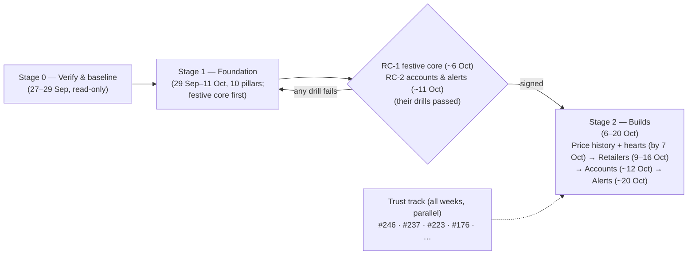
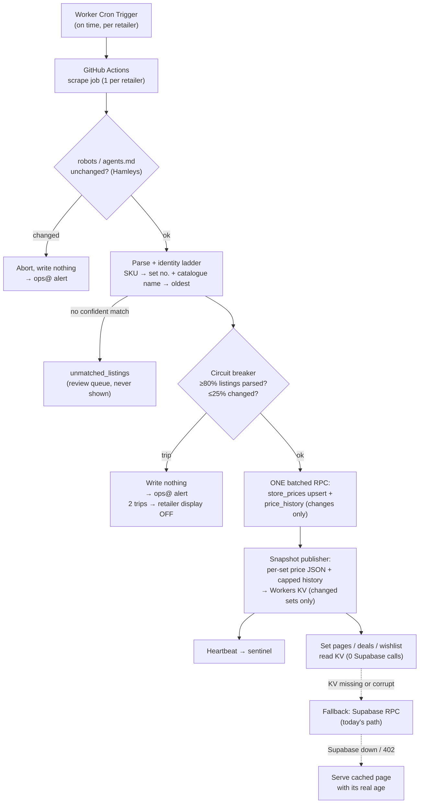
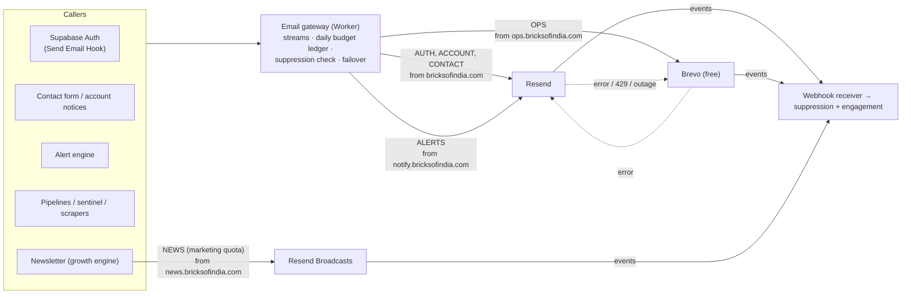
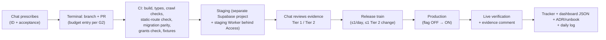

# BOI — Cycle 2 Master Plan (v2.4: foundation first, festive schedule)
## Build the support system first, then three retailers, price history, and wishlist/accounts/alerts

**Version:** 2.4 · 27 Sep 2026 (v2.4 folds in the Stage 0 report: FP3.0 security hotfix, FP2.3 baseline squash, FP5.7 stock column, FP1.6, D26–D28, I18–I25, measured capacity). Earlier: v2.3 (v2.3 adds Supabase's answer: no grace period on any future limit breach, so hard quota guards are added, plus the sale/billing-cycle overlap risk R38). Based on 2.2, which replaced v1.0, v2.0 and v2.1. v2.2 fixes the schedule: the **festive-ready core** (foundation plus price history plus hearts plus live-site fixes) goes live **by 7 Oct**, before the sale starts on 8 Oct. Retailers go live 9–16 Oct, accounts ~12–13 Oct, alerts ~20 Oct. Proof windows are now measured in scrape cycles instead of calendar days, and the single certificate is split in two (RC-1, RC-2). Backups go to Abhinav's personal Google Drive. Email setup done on 27 Sep is recorded.
**Status:** **Approved by Abhinav 27 Sep** ("the plan is okay"). All G0 decisions answered: D1, D2, D3, D7, D9, D10, E1, E2, E3.
**Supersedes:** §13 and §14 of `BOI_Cycle1_Status_Report_2026-09-27_v2.md`, and plan v1.0.
**What changed from v1.0:** the builds no longer start in week 2. **A Foundation stage builds and drills the whole support system first.** Only signed **Readiness Certificates** (§7: RC-1 for the festive core, RC-2 for accounts and alerts) open the builds that depend on them. The log-quota contingency becomes a **core foundation build** (the price snapshot layer). A full **email and communication system** is added (§6). A **staging environment**, **monitoring**, and a **failure-scenario matrix** (§5) are added, where every failure must degrade to *honest*, never to *wrong*.

---

## 0. How to use this document

- **Single source of truth for Cycle 2.** It's committed to `docs/plans/BOI_Cycle2_Master_Plan.md`. The tracker and dashboard JSON track the status of the IDs defined here.
- **Every piece of work has an ID** and a GitHub issue. Nothing closes without an evidence comment. No `Closes #` keywords.
- **Gates, not dates.** Week numbers are estimates.
- **§17 is the complete register.** Anything new goes there first.
- **Changes** only with Abhinav's OK, recorded in the changelog.

---

## 1. The approach: foundation first

### 1.1 The principle

> **Every failure must degrade to honest, never to wrong.**
> If a retailer, Supabase, the email provider, GitHub Actions or a scraper fails, the site may show *older* prices (with their real age), *fewer* badges, or *delayed* alerts. It must never show a wrong price, a false deal, a wrong-set match or a false alert, and it must never lose a user's data.

### 1.2 The three stages

### 1.3 What the foundation can and can't do

What **can** be solved up front: capacity (the snapshot layer takes Supabase off the page-rendering path), safe change (staging, migrations, flags, backups), security (RLS, the `authenticated` role), the email system (addresses, DNS, gateway, failover, suppression), scraping integrity (contract, circuit breaker, kill switch, proven on MyBrickHouse and Toycra first), monitoring, legal pages and consent, measurement, and documentation.

What **can't** be solved up front: a new retailer's actual match quality, whether our alert rules produce zero false alerts, and real user behaviour. These can only be proven with the real build. **The foundation provides a safe harness for each one** (shadow mode, shadow alerts, flags, kill switches), so each is proven in controlled conditions before any user sees it. Nothing ships to users until that proof exists.

Two guards against the foundation dragging on:

1. The foundation has **fixed exit criteria** (the Readiness Certificates), not "until it feels ready". Each build waits only for the foundation pieces it actually depends on (§7), not for every pillar.
2. The **trust track keeps running in parallel**, so the site keeps getting better during the foundation weeks. The foundation weeks also give GA4 a clean baseline, which we need anyway to measure what the wishlist changes.

---

## 2. Hard constraints (these don't move)

1. **Zero cost.** Supabase Free, Resend Free (**pay-as-you-go must stay OFF**), a second email provider on its free tier, GitHub Free, ImprovMX Free. Cloudflare Workers Paid ($5) plus R2/KV kept within their included usage.
2. **Credibility lock.** No fabricated content, no guessed matches, no silent edits. Dated correction notes.
3. **Locked pricing rules** (Cycle 1 §2): as listed; anchor chain MyBrickHouse → Toycra (with safeguard) → catalogue → none; Deal ≥10%, Hot deal ≥20%, in stock, ≤12h; listed prices only; out-of-stock, tie and "Only at X" rules; age taken from the scrape time.
4. **Retailer identity:** SKU → set number confirmed by catalogue name → oldest listing. Never by price, never the first number in the title.
5. **Hamleys:** only what robots.txt and agents.md allow. **FirstCry:** public price, not Club Price. No outreach.
6. **Affiliate honesty:** ABHINAV12 disclosure rules and Gate 13 everywhere.
7. **Two-Claude workflow and deploy policy** (Tier 1/Tier 2, tree-ancestry check).
8. **Deploys:** 1–2 a day at most, newest run only.
9. **No stop-gaps.**

---

## 3. The target workflow

### 3.1 Price data: scrape → validate → store → publish → page

### 3.2 User journey: visit → heart → account → alerts

```mermaid
flowchart LR
  V["Visitor (cached page,<br/>no auth code loaded)"] --> H["♥ Heart<br/>(saved in browser only)"]
  H -->|3rd heart| PR["Prompt: save across devices<br/>+ price-drop emails"]
  PR --> SI{"Sign in"}
  SI -->|Google| ACC["Account"]
  SI -->|Email link<br/>+ Turnstile| GW1["Email gateway<br/>(AUTH stream)"] --> ACC
  ACC --> C["Consent: 18+, purposes,<br/>newsletter separate (unticked)"]
  C --> M["Merge browser hearts<br/>→ wishlist_items (RLS)"]
  M --> AL["Alert engine (daily digest)"]
  AL --> GW2["Email gateway<br/>(ALERTS stream)"] --> U["Inbox: one-click<br/>unsubscribe per type"]
  U -->|bounce / complaint| SUP["Suppression list"]
```

### 3.3 Email: every message goes through one gateway

### 3.4 Changing anything: plan → staging → production → evidence → docs

---

## 4. Every risk: solution, fallback, proof

Each risk flagged in v1.0, plus the new ones found while designing the foundation (R27–R37). **Solution** = the foundation build that removes or contains it. **Fallback** = what happens if the solution itself fails. **Proof** = the test or drill that has to pass for the Readiness Certificate (§7).

| # | Risk | Solution (foundation ID) | Fallback | Proof |
|---|---|---|---|---|
| R1 | **Any Free-plan limit exceeded → restriction (402), now with no grace period** (Supabase, 27 Sep: the previous restriction was **Storage Size**; "if plan limits are exceeded again, a restriction can apply without another grace period"). Log ingestion (1 GB) is metered but not enforced until early 2027. | **FP6.4 hard guards** on storage size, DB size and egress (automatic pause before the limit). **FP1.1 snapshot layer** takes Supabase off page rendering (egress, requests, logs). FP1.2 request budget. | Pages fall back to the Supabase call; if that fails, the cached page is served with its real age. | Drill D-6 extended: simulate storage at 90% → uploads refuse and ops@ is alerted. Requests/day, egress and storage measured before and after. |
| R2 | Auth makes cached pages dynamic | FP3.4 **static-route CI check** plus G1. Auth code loads only on /account and /auth. | Flag hides the auth UI, and the next train restores caching. | CI fails on a deliberately dynamic test route. Staging shows `x-nextjs-cache: HIT` after auth is enabled. |
| R3 | `authenticated` role over-exposed | FP3.1 audit → FP3.2 RLS and grants hardening. FP3.3 grants checker covers all 3 roles. | Signed-in features stay off (flag) until it's fixed. | Negative-test suite on staging: a test user is refused on every table. |
| R4 | Wrong-set matches at new retailers | FP5 scraper contract, identity ladder, `unmatched_listings`, match audit, kill switch, purge on remap. **Proven first on MyBrickHouse and Toycra** (FP5.8). | Retailer display OFF (1 database update + revalidate). | Drill D-4: kill switch on/off on production in under 10 minutes. The retrofit comparison (≥12 scrape cycles) finds 0 new mismatches. |
| R5 | A broken parse corrupts all prices | FP5.3 circuit breaker (≥80% parsed, ≤25% changed), for **all** retailers. | 2 trips turn display off automatically. | Drill D-5: a malformed fixture trips the breaker; nothing is written; the ops@ alert arrives. |
| R6 | False or noisy alerts | Rules in the build spec (§9.3) plus FP6.4 automatic pause. The engine can't run unless the freshness sentinel is green. | `alerts_enabled` flag OFF (immediate). | Shadow week in Stage 2 (a build gate, since it can't be proven earlier). |
| R7 | Email quota exhaustion or sign-in failure | **FP4 email system**: gateway with streams, a budget ledger, AUTH reserved first, Brevo failover, Google sign-in (uses no email). | Failover provider. Google sign-in. Alerts queue to the next day. | Drill D-7: force Resend errors on staging → AUTH goes out through Brevo. Budget cap test. |
| R8 | Deploy churn (R2, Class A, Supabase cold cache) | FP2.5 release trains, FP1.4 R2 lifecycle, FP1.1 (cold renders read KV, not Supabase) | Hold trains. | Class A per deploy measured. Deploy count logged. |
| R9 | Workers CPU overage | FP1.3 `/api/img` resize and cap. KV reads are cheap. SVG charts, no chart library. | Overage is cents a month; logged as an exception. | CPU per route before and after. |
| R10 | Egress growth | FP1.1 (history is served from KV, not Supabase) | History cap. | Egress trend after the snapshot layer. |
| R11 | Database regrows from history | FP10.2 verify, and fix the writer to change-only | Retention job. | SQL evidence: rows per day before and after. |
| R12 | Migration drift | FP2.3 fix #197, CI parity check, no MCP migrations (G7) | Rehearse on staging first. | CI fails on a deliberate drift fixture. |
| R13 | GitHub Actions minutes run out | FP6.5 minutes budget. Lean jobs. | Prioritised job list (scrapes first). | P0.7 measurement plus a monthly report. |
| R14 | Scrape lag | FP5.9 Worker Cron Trigger, one job per retailer | Staleness shows honest age with no badge. Alerts paused by the freshness gate. | Lag measured over ≥3 days (≥12 dispatches) after the Cron Trigger. |
| R15 | A retailer blocks us | Stage 0 feasibility spikes. Polite scraper identity with a `/bot` page. | Retailer not built, reason recorded. | P0.12 report. |
| R16 | Legal and compliance | FP7: privacy policy, terms, consent model, grievance contact, deletion flow, 18+, robots snapshot | Accounts stay off until done. | FP7 checklist signed by Abhinav. |
| R17 | Review errors under more traffic | Trust track T.1 (parallel) | Alerts don't launch until top-traffic reviews are fixed. | #246 burn-down. |
| R18 | Approval fatigue | Work-in-progress limits, trains, grouped approvals | Pause the growth track. | — |
| R19 | Docs drift | FP9 protocol, daily log, weekly reconciliation | Reconciliation catches it. | Weekly diff = 0. |
| R20 | User data loss | FP2.6 **3-tier backup**: nightly encrypted copy to Abhinav's personal Google Drive (`drive.file` scope only), monthly offline copy to the encrypted external HDD, pre-change snapshots. Plus a **restore drill into staging**. | Last backup (≤24h). | Drill D-2: full restore into staging and row counts match. |
| R21 | "Unknown" themes | FP10.1 backfill | Theme features hidden. | Unknown count = 0. |
| R22 | Newsletter and accounts collide | FP7.3 one consent model, per purpose | — | Consent-table audit. |
| R23 | Slug changes break wishlists | Key on `set_num` (G-rule in the spec) | — | Unit test. |
| R24 | Misleading charts | Spec rules (steps, gaps, displayed retailers only) | Chart flag OFF. | Visual QA on 10 sets. |
| R25 | SEO or structured-data regression | Offers read from the same snapshot as the page. `noindex` on account pages. Existing crawl checks. | — | CI crawl checks. |
| R26 | Bot sign-ups | FP3.5 Turnstile plus auth rate limits | Email sign-in paused; Google sign-in only. | Turnstile verified on staging. |
| **R27** | **No DMARC record on bricksofindia.com** (checked 27 Sep). Big inbox providers expect SPF/DKIM/DMARC, and our sending grows. | FP4.2 DMARC `p=none` with reporting → review → `p=quarantine` | Stay at `p=none`. | DNS check plus 2 weeks of clean reports. |
| **R28** | Staging on the same Supabase organisation **shares the org's quotas** (quotas are per organisation) | FP2.1 staging project in a **separate organisation** | Local Supabase (Docker) for tests. | Staging usage appears in its own org. |
| **R29** | Email provider outage | FP4 gateway failover (Resend ↔ Brevo). The standby is used daily for ops mail, so it's always proven warm. | Google sign-in; queue. | Drill D-7. |
| **R30** | Accidental Resend charges (pay-as-you-go exists on Free) | FP4.1 confirm it's OFF. The gateway caps below 100/day. | — | Screenshot of the billing setting. |
| **R31** | **The snapshot layer itself** serves stale or wrong data | Snapshots carry `scraped_at`, a version and a checksum. The page falls back to Supabase if the snapshot is missing, corrupt or older than the last scrape heartbeat. A parity job compares snapshot vs view on a sample every run. | Snapshot flag OFF → today's path. | Drill D-3: corrupt a snapshot on staging → the fallback works. 100% parity over ≥12 consecutive scrape cycles (≥3 days, including a deploy). |
| **R32** | Staging project pauses (7 days inactive) | Weekly CI test run keeps it active. It can be resumed within a year if paused. | Resume manually. | — |
| **R33** | Human replies from role addresses fail DMARC | FP4.5 Gmail "Send mail as" through Brevo SMTP (DKIM-aligned), not Gmail's own servers | Reply from abhinav@. | Test reply passes DMARC (headers checked). |
| **R34** | Abhinav unavailable for days | FP6: automatic pause of risky jobs, sentinel, daily ops digest, runbooks | Everything degrades honestly on its own. | Drill D-6: stop-the-line fires with no human involved. |
| **R35** | Cloudflare outage | No hot standby at zero cost (accepted risk, documented). Netlify is no longer a warm path. | Wait it out. The external probe reports it. | Documented in the risk register. |
| **R36** | GitHub Actions outage | Scrapes stop → honest age, badges drop, alerts auto-pause | — | Covered by the freshness gate (D-6). |
| **R37** | More secrets and tokens (KV write token, Brevo key, hook secret, Turnstile, unsubscribe HMAC) | FP3.6 secrets manifest updated. Least-privilege tokens. A rotation note per secret. | Rotate. | code-audit manifest check green. |
| **R38** | **The sale (8–11 Oct) falls in the last 4 days of the current Supabase cycle (11 Sep–11 Oct).** A traffic spike could push egress past 5 GB, and with no grace period left that means an immediate restriction. | Snapshot cutover by 5 Oct (render egress leaves Supabase). A daily egress projection in the ops digest from 1 Oct. The FP6.4 egress guard pauses non-essential Supabase readers (admin jobs, audits, non-critical Actions) at 4.0 GB. | Pages serve from the snapshot and cache. | Daily egress readings 1–11 Oct. |

---

## 5. Failure-scenario matrix: what the site does when things break

| Scenario | Today | After the foundation |
|---|---|---|
| Supabase restricted or down | Pages on cold renders fail or lose prices; scrapes fail (the 13–14 Sep outage) | Pages keep serving prices from KV with their true age. Scrapes pause. Badges drop at 12h. Alerts auto-pause. ops@ is alerted. |
| One retailer changes its site | The parse could write wrong or empty data | Breaker writes nothing. 2 trips → that retailer is hidden. The others are unaffected. |
| A retailer blocks the scraper | Silent staleness | Staleness alert. Honest age. That retailer's badges drop. |
| GitHub Actions late or down | Up to 5h late (measured), no alert | Cron Trigger dispatches on time. If Actions is down: honest age plus a sentinel alert. |
| Resend down or quota hit | Contact form fails silently | Gateway fails over to Brevo. AUTH is always reserved. Alerts queue. |
| Bad deploy | Rollback by redeploying | Flag OFF on the next train. Snapshot and DB kill switches are immediate. |
| Bad migration | Manual | Rehearsed on staging, rollback SQL in the PR, backup taken first. |
| User data corrupted or deleted | No automated backup | Nightly encrypted backup, restore drilled. |
| Abhinav away | Jobs continue unwatched | Stop-the-line automation plus a daily digest waiting in the inbox. |
| Cloudflare down | Site down | Site down (accepted). The external probe records how long. |

---

## 6. The foundation: Stage 0 and ten pillars

### 6.1 Stage 0: verify and baseline (27–29 Sep, read-only, no new code)

| ID | Work | Output |
|---|---|---|
| P0.1 | Close all Cycle 1 pending verifications (Cycle 1 §9): Check 11b, 04:00Z cleanup (#183), Story #76 plus email confirmation, social run (#181), Gates 12/13 first run, full-day request count by caller, PR-A acceptance, two PR-D pages | Overnight report |
| P0.2 | Docs-only close-out commit: tracker and JSON reconciled to the v2 report and this plan, plan committed, RLFM note, one issue per ID, guardrails into `CLAUDE.md` | Commit plus issue list |
| P0.3 | ✅ **Supabase answered 27 Sep:** log ingestion allowance is 1 GB (5 GB is egress); log limits aren't enforced until early 2027 (soft launch); the org is fully operational; **the prior restriction was caused by Storage Size**; **any future limit breach can restrict with no grace period**; banner clears after several cycles under limits; current cycle 11 Sep–11 Oct. (Answered by Supabase's AI agent; ask a human to confirm the restriction-history point, which is optional but useful.) | Answer filed |
| P0.4 | #197 drift inventory; settle 5 vs 6 | Listing |
| P0.5 | Untracked patches, `generate_sfx.py`, unpushed branches (incl. `chore/gemini-model-migration`) | Recommendation per item |
| P0.6 | GA4 bot-filter state and event plan | Proposal |
| P0.7 | Capacity baseline (every "verify" cell in §10): Supabase requests by caller, R2 Class A per deploy, CPU per route, **repo visibility and Actions minutes**, Resend sends per day | Filled table |
| P0.8 | Price history: writer change-only? stock changes kept? "Updated X ago" computed at render or in the browser? | Code references plus SQL |
| P0.9 | Security audit for all 3 roles, every table; growth schema reachable?; which key ships to the browser; does a stores table exist? | Audit table |
| P0.10 | Netlify plan (B1), B5/B7, Cloudflare Images Sources | Evidence |
| P0.11 | Jaiman postmortem | Written postmortem |
| P0.12 | Retailer feasibility spikes (Jaiman, Hamleys, FirstCry) plus Brickset terms | Report |
| **P0.13** | **Email inventory:** every place that sends email today (contact form, newsletter, pipeline review and rework emails, health checks, capacity alerts, story emails), with provider, from-address and volume. Resend: domains used, **pay-as-you-go OFF?**, webhook endpoints used. | Inventory table |
| **P0.14** | **Supabase platform facts:** number of existing projects and organisations (is there a free slot for staging in a *separate* organisation?). Is the Auth **Send Email Hook (HTTP)** available on Free? Current auth settings. | Evidence |
| **P0.15** | **Cloudflare platform facts:** existing KV namespaces, Zero Trust / Access availability (for staging), DMARC Management availability, Email Routing status (not to be enabled) | Evidence |
| P0.16 | Answer the G0 decisions (§14) | Answers |

### 6.2 The ten pillars (Stage 1, 29 Sep–11 Oct; festive-core pieces first, see §7 and §8)

**FP1 — Capacity and resilience**

| ID | Build | Detail |
|---|---|---|
| FP1.1 | **Price snapshot layer** (ADR required) | After each scrape batch, the publisher reads `set_price_summary` for *changed sets only* (1 batched call) and writes one KV key per set: `set:{set_num}:v1` = `{version, scraped_at per store, offers[], anchor, badge, history{store:[[day,price,in_stock]]} capped at 180d/60 pts, checksum}`, plus list keys `list:deals:v1`, `list:home:v1` and `meta:heartbeat`. The token only allows writing to this one namespace. **Reader:** KV → validate version, checksum and freshness against the heartbeat → otherwise fall back to the Supabase RPC → otherwise serve the cached page with its real age. **Parity mode:** on every scrape cycle, compare the snapshot against the view on 50 sets (plus all sets that changed). **100% match over ≥12 consecutive cycles, spanning ≥3 days and at least one deploy**, is required before cutover (Tier 2, flag `snapshot_read`). |
| FP1.2 | Request budget and per-caller daily report | Extends Check 11/11b. Feeds the ops digest (FP6.3). |
| FP1.3 | `/api/img` resize and size cap | og:images up to 8 MB are currently loaded into memory |
| FP1.4 | R2 lifecycle tuning | After the 29 Sep check. Shorter retention if old build caches are useless, keeping a rollback window. |
| FP1.5 | Cold-render review | After FP1.1: measure what still hits Supabase on cold renders (reviews, articles) and decide whether the snapshot should extend to them |
| FP1.6 | **On-demand revalidation from the snapshot publisher** (after RC-1, gated by re-verifying B7 on Workers in staging): the publisher revalidates only the set pages whose snapshot changed, and the time-based fallback lengthens. Why: Stage 0 shows R2 Class A (~49k/day, above the 1M/month free tier) is driven by **runtime ISR regeneration**, not deploys. This cuts Class A, Workers CPU and cold renders together. |

**FP2 — Safe change**

| ID | Build | Detail |
|---|---|---|
| FP2.1 | **Staging Supabase project in a separate organisation** | Quotas are counted per organisation, so a separate org keeps staging from using up production's quota. Schema comes only from repo migrations. Seeded with the catalogue and prices, **no user data**. A weekly CI run keeps it from pausing. |
| FP2.2 | **Staging Worker** | A separate Worker bound to the staging DB, its own KV namespace and its own R2 bucket (3-day lifecycle). Behind **Cloudflare Access** (free tier), `noindex`. |
| FP2.3 | **Fix #197 by baseline squash** (Stage 0: 55 repo files vs 67 production rows; 31 production-only, 19 repo-only, 36 renamed; production keeps all SQL): (1) export all 67 production `statements` to `supabase/migrations/_history/` (a record, not run); (2) move the 55 repo files to `supabase/migrations/_archive/`; (3) generate a **baseline** from production: `supabase db dump --schema-only` **plus** a roles script (growth LOGIN roles) **plus** required non-schema objects (storage buckets, `pg_cron` jobs, extensions) and check that nothing is missing; (4) **rehearse on staging** (D-8): build a fresh DB from the baseline, then diff its schema dump against production's = **0 differences**; (5) only then, on production, back up `schema_migrations`, `repair --status reverted` the 67 old versions and `--status applied` the baseline (metadata only, Tier 2); (6) CI parity check through a `ci_readonly` role (SELECT on `schema_migrations` only), run nightly and on migration PRs. G7 is enforceable only after this. | Rehearsed on staging |
| FP2.4 | **Flag system** | Build-time flags (UI features) in one file. Runtime flags in KV (`snapshot_read`, `retailer:{id}:display`, `alerts_enabled`, `email_stream:{name}`), each with a runbook. Retailer display changes trigger a targeted revalidation. |
| FP2.5 | Release trains in `DEPLOY_POLICY.md` | ≤1 deploy a day, ≤1 Tier 2 change per train, WIP limits |
| FP2.6 | **Backups plus restore drill (3 tiers, D9 decided)** | **Tier A (automatic):** a GitHub Actions job every night exports the critical tables (`store_prices`, `price_history`, retailer registry, user tables once they exist), and every Sunday a full dump. Both are compressed and **encrypted before leaving the runner** (`age`; only the public key is in the repo, the private key is held by Abhinav), then uploaded to a `BOI-Backups` folder on **Abhinav's personal Google Drive (bhargav.abhinav@gmail.com, 1 TB)**. Access uses an OAuth refresh token with the **`drive.file` scope only**, so the job can see **only the files it created**, never the rest of the personal Drive. The OAuth consent screen is in **Production** (not Testing), so the token doesn't expire after 7 days (the YouTube lesson). A failed upload is a sentinel alert. Retention: 30 nightly plus 12 weekly (~1–1.5 GB). **Tier B (offline):** on the 1st of each month the ops digest reminds Abhinav to copy the latest weekly dump plus the local BOI folders to the encrypted external HDD, then unplug it (`BOI_Local_Backup_Runbook.md`). **Tier C (pre-change):** the existing `boi-db-backups\` snapshots before every migration or data fix. **Monthly restore drill into staging.** |

**FP3 — Security**

| ID | Build |
|---|---|
| **FP3.0** | **URGENT hotfix (Stage 0 finding, HIGH):** the `http` extension functions in `public` (`http`, `http_get`, `http_post`, `http_put`, `http_patch`, `http_delete`, `http_head`, all overloads) are executable by `anon`/`authenticated`, so anyone with the public key can make the database send web requests (SSRF). Fix: a repo migration that `REVOKE`s EXECUTE from `PUBLIC, anon, authenticated` (callers that run as postgres/service_role keep working). Because of #197 drift it's applied with psql in one transaction, then recorded with `supabase migration repair --status applied <version>`: a documented one-off exception to G7's tooling, not to its principle (repo file first). Moving `http` to an `extensions` schema is deferred to FP3.2 (it changes callers' paths). |
| FP3.1 | Act on the P0.9 audit |
| FP3.2 | RLS on every table in every exposed schema. Explicit per-table grants for `authenticated`. Growth schema not reachable. |
| FP3.3 | Grants checker covers anon, authenticated and service_role, with a **negative-test suite** on staging (a test user attempts every table) |
| FP3.4 | **Static-route CI check:** the build fails if any route currently ISR or static turns dynamic (guards R2) |
| FP3.5 | Turnstile widget plus Supabase auth rate limits, configured and tested on staging |
| FP3.6 | Secrets manifest updated for every new secret. Least-privilege tokens. Rotation notes. |
| FP3.7 | `/.well-known/security.txt` pointing to security@ |

**FP4 — Email and communication system.** Full design in §6.3.

**FP5 — Scraping and data integrity**

| ID | Build |
|---|---|
| FP5.1 | **Retailer registry, created from scratch** (Stage 0: no stores table exists; `store_prices.store_id` is text) plus the runtime display flag. Every consumer (snapshot, deals, best price, JSON-LD, store-list copy, charts, alerts) filters on it. **Also audit the legacy `prices` table** (it still holds FirstCry/Hamleys rows): find every reader, then archive and drop it if unused (backup first) so old data can't leak. |
| FP5.2 | Shared scraper-contract module |
| FP5.3 | Circuit breaker (≥80% parsed, ≤25% changed, or write nothing; 2 trips → display off) |
| FP5.4 | Identity-ladder module with test fixtures: a title without a number, a FirstCry-style multi-set variant page, Club vs public price, a false number in the title ("F2004", "NCC-1701") |
| FP5.5 | `unmatched_listings` queue plus a weekly review list in the ops digest |
| FP5.6 | Match-audit report per run |
| FP5.7 | **History writer rebuilt (Stage 0: today it appends a row for every listing every cycle, and `price_history` has no stock column):** migration adds `in_stock boolean` (null = not recorded, for everything before the migration); the writer then records **only changes of price or stock**, plus the first observation. Purge-on-remap tool (backup first). **Must land by ~1 Oct** so stock data exists before the charts go live. |
| FP5.8 | **Retrofit MyBrickHouse and Toycra onto the contract.** The new-contract scraper first runs in **dry-run comparison** next to the old one (it computes but doesn't write) for **≥12 consecutive cycles** with 0 differences in matches, prices, stock, deal/hot-deal and tie counts. Only then does it take over writing (Tier 2). |
| FP5.9 | **Worker Cron Trigger** plus `GH_DISPATCH_TOKEN`, one dispatch per retailer. Lag measured over ≥3 days (≥12 dispatches). |
| FP5.10 | Scraper identity: user agent `BricksOfIndiaBot/1.0 (+https://bricksofindia.com/bot; bot@bricksofindia.com)`, a `/bot` page explaining what we collect and how to reach us, and the robots/agents.md snapshot mechanism |

**FP6 — Monitoring and automatic safety**

| ID | Build |
|---|---|
| FP6.1 | **Sentinel Worker** (Cron Trigger every 15 min): job heartbeats (KV), key-page probes (200, cache HIT, price age), snapshot freshness, email-budget state |
| FP6.2 | **External probe**: an hourly GitHub Actions check from outside Cloudflare (catches a Cloudflare-wide outage) |
| FP6.3 | **Daily ops digest** at 08:00 IST to ops@: capacity table, freshness per retailer, breaker trips, unmatched queue, email budget, errors, deploys. Replaces scattered system emails where possible. |
| FP6.4 | **Automatic stop-the-line and hard quota guards**: the triggers in §10.2 set flags themselves (alerts OFF, retailer display OFF) and email ops@. **Hard guards, because there is no grace period left:** storage buckets ≥800 MB → media uploads (video pipelines) refuse to upload and the cleanup job runs; DB size ≥400 MB → retention job runs and non-essential writers pause; egress projected ≥4.0 GB for the cycle → non-essential Supabase readers pause. Each guard runs *before* the write or read, not after. No human needed. |
| FP6.5 | Monitoring for Actions minutes and Workers CPU |
| — | UptimeRobot's free plan is excluded: it's for non-commercial use only, and BOI earns affiliate revenue |

**FP7 — Legal and trust**

| ID | Build |
|---|---|
| FP7.1 | **Privacy policy rewrite:** a data inventory (GA4, contact form, newsletter, accounts, wishlist, alerts, browser storage), processors (Supabase, Cloudflare, Resend, Brevo, Google), retention, rights, grievance contact **privacy@** |
| FP7.2 | Terms of use: prices as listed with no guarantee, affiliate disclosure, corrections policy |
| FP7.3 | Consent model (`user_consents`, notice versions, one consent per purpose) and the newsletter consent flow |
| FP7.4 | Account-deletion flow design plus a public **data-deletion page** (also meets Meta's requirement, #142) |
| FP7.5 | 18+ rule (DPDP: under-18s need verifiable guardian consent) |
| FP7.6 | **Corrections page** with the policy, a log of dated corrections, and corrections@ |
| FP7.7 | Abhinav's review. A professional check of the DPDP wording is recommended (this isn't legal advice) |

**FP8 — Measurement**

FP8.1 GA4 filters (known-bot exclusion is automatic and can't be toggled; the actions are an **internal-traffic** filter set to Active, a **developer** filter, the Enhanced Measurement "browser history" page views ON, and the tag sending only on `bricksofindia.com`) · FP8.2 event plan instrumented (`outbound_retailer_click` now; heart and signup events wired but inactive until Stage 2) · FP8.3 weekly baseline report · FP8.4 success metrics defined: signups per 1k sessions, hearts per session, alert click rate, unsubscribe rate, returning-visitor rate.

**FP9 — Documentation and operations**

ADRs (snapshot layer, static pages with client-only auth, retailer registry and kill switch, scraper contract, email gateway, staging, backups) · runbooks (retailer kill switch, alert pause, capacity stop-the-line, auth incident, email failover, backup restore, snapshot fallback) · daily log · weekly reconciliation · `CLAUDE.md` guardrails · `DEPLOY_POLICY.md`.

**FP10 — Data foundations**

FP10.1 "Unknown" theme backfill (152 sets) · FP10.2 change-only history writer, from P0.8 (shares work with FP5.7) · FP10.3 ✅ **already done** (`PriceAge.tsx` is client-side since PR-A #227; Stage 0 confirmed) · FP10.4 "More [theme] sets" no longer shows unpriced promo items; homepage CTAs get distinct destinations.

### 6.3 Email and communication system (FP4)

**FP4 work items** (FP4.3 and most of FP4.2/FP4.4 done 27 Sep; see the setup status below): FP4.1 check the Resend account (pay-as-you-go OFF, domains, webhook) · FP4.2 DNS: DMARC, Resend `notify.` and `news.`, Brevo root/`notify.`/`ops.` · FP4.3 ImprovMX aliases and Gmail labels/filters · FP4.4 Brevo account and sender identities · FP4.5 "Send mail as" through Brevo SMTP for human replies · FP4.6 email gateway (streams, ledger, suppression, idempotency, failover, templates, unsubscribe) · FP4.7 webhook receiver (Resend and Brevo events → suppression and engagement) · FP4.8 sign-in email path (Send Email Hook or SMTP with the swap runbook) · FP4.9 move every existing sender onto the gateway (P0.13 inventory) · FP4.10 DMARC progression to `p=quarantine`.

**Current state (checked by public DNS on 27 Sep)**

| What | Finding |
|---|---|
| Inbound mail | MX → **ImprovMX** (free: 1 domain, **25 aliases**, 500 forwards/day, **no sending**) |
| Outbound | **Resend** on the root domain: DKIM `resend._domainkey` present; return path `send.bricksofindia.com` (Amazon SES). One sender in use: `abhinav@bricksofindia.com` |
| SPF (root) | `v=spf1 include:spf.improvmx.com ~all` |
| **DMARC** | **None** (R27) |
| Resend Free | 100/day, 3,000/month, **3 domains**, **1 webhook endpoint**; marketing broadcasts separate (1,000 contacts); pay-as-you-go exists and **must stay off** |

**Principles**

1. **Addresses are identities and routes, not capacity.** Aliases are free (ImprovMX allows 25). Capacity comes from providers, and more addresses on the same provider add none.
2. **Separate reputations by subdomain.** Price alerts (higher complaint risk) and the newsletter each get a subdomain, so they can't damage the deliverability of sign-in emails.
3. **Two independent providers, both used every day.** Resend for customer email; Brevo (free, 300/day) for internal mail and as the standby. A backup that's used daily is known to work.
4. **One gateway.** Every email goes through one module that enforces streams, budgets, suppression, idempotency and failover.
5. **No `noreply@`.** Every user email has Reply-To hello@, and a human reads it.

**Addresses to create** (all are ImprovMX aliases or provider sender identities, so no new paid mailboxes)

| Address | Role | Incoming mail goes to | Sends through |
|---|---|---|---|
| abhinav@bricksofindia.com | **Existing.** Personal only; no longer a system sender | bricksofindia007@gmail.com (as set up 27 Sep) | — |
| **hello@**bricksofindia.com | Public contact, Reply-To on every user email, contact form | bricksofindia007@gmail.com (label *BOI/Hello*) | Human replies: Gmail "Send mail as" via Brevo SMTP (DMARC-aligned, R33) |
| **privacy@**bricksofindia.com | DPDP grievance contact, consent withdrawal, deletion requests, Meta data-deletion contact | bricksofindia007@gmail.com (label *BOI/Privacy*, starred) | Brevo SMTP |
| **corrections@**bricksofindia.com | Readers report factual errors (linked from every review and article, and the corrections page) | bricksofindia007@gmail.com (label *BOI/Corrections*) | Brevo SMTP |
| **security@**bricksofindia.com | Security reports (security.txt) | bricksofindia007@gmail.com | — |
| **login@**bricksofindia.com | Sender: sign-in links, account notices (deletion or consent receipts) | Alias → hello@ | Resend (root) → failover Brevo (root) |
| **alerts@notify.**bricksofindia.com | Sender: price-alert digests | None (Reply-To hello@) | Resend (notify.) → Brevo (notify.) per E4 |
| **news@news.**bricksofindia.com | Sender: newsletter | None (Reply-To hello@) | Resend Broadcasts (news.) |
| **system@ops.**bricksofindia.com | Sender: every internal and system email | None | Brevo (ops.) → failover Resend (root), critical only |
| alerts@, notifications@, newsletter@ **(root, legacy)** | In use today by the freshness watchdog, video/social notifiers and growth `send.py` (P0.13) | **Add temporary ImprovMX aliases → ops@ now** so replies don't bounce; removed after FP4.9 migrates these senders | Resend (root) until FP4.9 |
| **ops@**bricksofindia.com | Receives all system email (digest, alerts, breaker trips, pipelines) | **BOI ops inbox**, recommended bricksofindia007@gmail.com (E2) | — |
| **bot@**bricksofindia.com | Contact in the scraper user agent and /bot page | → ops@ destination | — |
| **postmaster@**, **abuse@** | Standard addresses that email providers expect | → ops@ destination | — |

That's **9 new aliases** (hello, privacy, corrections, security, login, ops, bot, postmaster, abuse) plus the existing abhinav@, so 10 of ImprovMX's 25. The three subdomain senders (alerts@notify., news@news., system@ops.) aren't aliases: they're sender identities set up inside Resend and Brevo, and replies to them go to hello@. **Resend domains:** root, notify., news. (all 3 free domains). **Brevo:** authenticates root (for failover and human replies), notify. and ops.

**Streams and budgets**

| Stream | From | Primary → fallback | Daily budget | Priority | Unsubscribe |
|---|---|---|---|---|---|
| AUTH | login@ | Resend → Brevo | **40 reserved** | 1 | n/a |
| ACCOUNT | login@ | Resend → Brevo | shares the AUTH reserve | 1 | n/a |
| CONTACT | hello@ | Resend → Brevo | 10 reserved | 2 | n/a |
| ALERTS | alerts@notify. | Resend → (E4) Brevo | Resend remainder (≤40), plus Brevo ≤250 if E4 = overflow | 3 | One-click, per type and all |
| OPS | system@ops. | Brevo → Resend (critical only) | Brevo ≤50 | 4 | n/a (internal) |
| NEWS | news@news. | Resend Broadcasts | Marketing quota (1,000 contacts) | — | One-click |

The gateway caps Resend at **90/day** (10 below the limit as a safety margin). If budget runs out, ALERTS queue to the next day's digest, and AUTH is never blocked by other streams.

**Gateway design (ADR)**

- A Worker module plus an HMAC-signed internal endpoint, so GitHub Actions jobs, pipelines and the alert engine all send through the same place.
- Checks run in this order: suppression (a KV mirror) → stream policy → budget ledger (daily KV counters) → idempotency key (no double sends) → provider adapter → on 5xx, 429 or timeout, switch to the fallback provider → record counts only (no message bodies stored).
- **Sign-in email:** Supabase **Send Email Hook** → gateway, *if* it's available on Free (P0.14). Otherwise Supabase's custom SMTP points at Resend, and a runbook switches it to Brevo SMTP in about 5 minutes. Google sign-in keeps working either way.
- **Templates:** plain text plus HTML. A shared footer says who we are, why you got the email, how to unsubscribe (where relevant), and links the privacy policy and hello@.
- **Unsubscribe:** `List-Unsubscribe` plus `List-Unsubscribe-Post` headers, and `/u/{signed-token}` (a GET shows a confirmation page, a POST unsubscribes in one click).
- **Webhook receiver** (replaces the dead growth-engine receiver): Resend's single free endpoint receives events for all 3 domains, and Brevo's events go to the same receiver. Bounces and complaints go into suppression; engagement events go to the growth schema (fixes part of #122).

**Setup status (27 Sep evening, confirmed by public DNS lookup)**

| Piece | Status |
|---|---|
| ImprovMX: 9 new aliases (hello, privacy, corrections, security, login → hello@, ops, bot, postmaster, abuse), all landing in bricksofindia007@gmail.com | ✅ Done |
| Resend `notify.bricksofindia.com` (alerts@): DKIM present | ✅ Verified |
| Resend `news.bricksofindia.com` (news@): DKIM present | ✅ Verified |
| Brevo `ops.bricksofindia.com` (system@): verification code, DKIM, and its own DMARC `p=none` | ✅ Verified |
| **Root `_dmarc.bricksofindia.com`** (covers root, notify. and news.) | ❌ **Still missing.** Add now: `v=DMARC1; p=none; rua=<reporting address>` |
| **Brevo authentication of the root domain** (needed for sign-in failover and human replies as hello@/privacy@) | ❌ **Not done.** No Brevo code on root yet |
| Gmail labels/filters per alias; "Send mail as" hello@, privacy@, corrections@ through Brevo SMTP | ⏳ Abhinav (after Brevo root authentication) |
| Resend pay-as-you-go confirmed OFF | ⏳ Abhinav (screenshot) |

**DNS changes** (Abhinav in the Cloudflare dashboard; the terminal prepares the exact records)

1. `_dmarc` TXT: `v=DMARC1; p=none; rua=<Cloudflare DMARC Management address>`. Watch reports for 2 weeks, then move to `p=quarantine`.
2. Resend: add the `notify.` and `news.` domains (DKIM plus return-path records).
3. Brevo: authenticate root, `notify.` and `ops.` (DKIM, and the verification TXT).
4. Leave the MX records alone. **Inbound stays on ImprovMX**, because moving MX mid-cycle risks losing mail. Cloudflare Email Routing (200 rules, programmable) is recorded as a future option only.

**Moving existing senders onto the gateway:** contact form (abhinav@ → hello@ and login@), newsletter (→ news@news.), pipeline, health-check and capacity emails (→ system@ops. to ops@). Every sender found in P0.13 must be moved or retired with a reason.

**Gmail setup (Abhinav):** filters and labels per alias. "Send mail as" hello@, privacy@ and corrections@ via Brevo SMTP. ops@ goes to the BOI ops inbox, with a filter that flags `[CRITICAL]` subjects.

---

## 7. The Readiness Certificates (the gates that open the builds)

Each build waits only for the foundation it depends on. **RC-1** opens the festive core (price history, guest hearts, and the retailer pipeline). **RC-2** opens accounts and alerts. Nothing is skipped: every pillar and every drill still has to pass before the build that needs it. Each certificate is written as `docs/plans/Cycle2_RC-1.md` and `Cycle2_RC-2.md` with evidence per line and signed by Abhinav.

### 7.1 Drills (all must pass)

| Drill | Scenario | Pass condition |
|---|---|---|
| **D-1** | Supabase unavailable (staging: block the DB) | Pages render prices from KV with honest ages. The alert engine refuses to run. ops@ is alerted. |
| **D-2** | Restore | The latest production backup restores into staging; row counts and checksums match |
| **D-3** | Snapshot corrupted or stale (staging) | The page falls back to the RPC with no wrong price shown; ops@ is alerted |
| **D-4** | Retailer kill switch (production, low-traffic hour, Tier 2) | The retailer disappears from set pages, deals and JSON-LD in under 10 minutes, and comes back cleanly |
| **D-5** | Circuit breaker (staging fixture, plus a production dry-run replay) | Nothing is written; the alert arrives; 2 trips turn display off |
| **D-6** | Stop-the-line with no human (stale heartbeat) | `alerts_enabled` goes OFF automatically; ops@ gets an email |
| **D-7** | Email provider failure (staging: invalid Resend key) | AUTH goes out through Brevo. The budget cap is enforced. A suppressed address isn't emailed. One-click unsubscribe works in Gmail. |
| **D-8** | Migration rehearsal (a real Stage 2 migration) | Applied and rolled back on staging with no drift |
| **D-9** | Load (old item #23) | A controlled spike on staging and on cached production pages: CPU and errors within limits, Supabase calls flat |

### 7.2 RC-1: festive core (target: signed ~6 Oct)

Opens: snapshot cutover → price history → guest hearts → retailer shadow runs.

- [ ] Stage 0 closed; **FP3.0 hotfix verified**; P0.9 audit fixes that affect current tables applied (FP3.1–3.3)
- [ ] FP2.1–2.5: staging, staging Worker, drift fixed with the CI parity check, flags, trains
- [ ] FP1.1: snapshot parity **100% over ≥12 consecutive cycles (≥3 days, including a deploy)**; requests/day and egress measured lower on staging and in parity
- [ ] FP1.3 `/api/img` fixed; FP1.4 R2 lifecycle set from the 29 Sep reading
- [ ] FP5.1–5.7 contract, breaker, registry and kill switch; FP5.8 retrofit **0 differences over ≥12 cycles**; FP5.9 Cron Trigger **≥3 days of lag measured, max gap < 12h**; FP5.10 bot identity
- [ ] FP6.1–6.4 sentinel, probe, ops digest, automatic stop-the-line
- [ ] FP2.6 Tier A backups running to Drive
- [ ] FP10.1, FP10.2, FP10.4 data fixes (FP10.3 already done); FP5.7 stock column live
- [ ] Drills **D-1, D-2, D-3, D-4, D-5, D-6, D-8, D-9** passed
- [ ] FP9 docs for the above (ADRs: snapshot, registry, scraper contract, staging, backups, sentinel; runbooks: kill switch, stop-the-line, snapshot fallback, restore)
- [ ] **Signed by Abhinav**

### 7.3 RC-2: accounts and alerts (target: signed ~11 Oct)

Opens: accounts → alert shadow week → alerts.

- [ ] RC-1 signed
- [ ] FP3.4–3.7: static-route CI check, Turnstile and auth rate limits (on staging), secrets manifest, security.txt
- [ ] FP4 complete: root DMARC live (`p=none` is enough to start sending; `p=quarantine` follows ~2 clean weeks later, E6), Brevo root authentication, gateway, webhook to suppression, every existing sender moved, both providers sending daily
- [ ] FP7 legal pages live: privacy, terms, corrections, data deletion, bot page (Abhinav reviewed)
- [ ] FP8.1–8.2 GA4 bot filter and events live. (The baseline keeps accumulating; it's for measurement, not a safety gate.)
- [ ] Drill **D-7** (email failover) passed; D-2 re-run with the user tables' schema
- [ ] FP9 docs: email gateway ADR, email-failover and auth-incident runbooks, `docs/email/ADDRESSES.md`
- [ ] Supabase's answer received, or the snapshot layer has made it irrelevant (measured)
- [ ] **Signed by Abhinav**

---

## 8. Stage 2: the builds, their sequence, and the timeline

### 8.1 Festive schedule (dated targets; gates still decide)

Assumes the terminal runs long jobs around the clock, chat reviews quickly, and Stage 0 turns up no blockers. **Tier 2 approvals and cutovers happen in two fixed daily train slots (~10:00 and ~22:00 IST), and never when anyone is exhausted.** Fatigue is how shortcuts creep in.

| Dates | Foundation / build | Live-site and trust (§16) | Proof clocks and fixed dates |
|---|---|---|---|
| **Sat 27 – Mon 29 Sep** | ✅ Stage 0 done (report 27 Sep). **FP3.0 security hotfix (now).** Docs correction commit. #204/#220 fixes on the next train. FP2.3 baseline prepared (repo-only). Email: root DMARC plus Brevo root authentication (Abhinav). Drive OAuth app (Abhinav) | Gate 14 PR; top-traffic review list; evidence closures | 28 Sep QP #35 · 29 Sep R2 check |
| **Mon 29 Sep – Wed 1 Oct** | FP2.3 drift fix → FP2.1/2.2 staging → FP2.4 flags. FP3.1–3.3 security. FP5.1–5.7 contract, registry, breaker. FP5.9 Cron Trigger. FP1.1 snapshot publisher built on staging. FP1.3 `/api/img`. **FP5.7 `in_stock` column plus change-only writer** | #246 batch 1; T.3 40912; T.5 claim; FP10.4; FP10.1 themes | **Cron lag clock starts** |
| **Thu 2 Oct** | Snapshot publisher on production in **parity mode**. Retrofit **dry-run comparison** starts. FP6.1–6.4 sentinel/digest/stop-the-line. FP2.6 backups | #246 batch 2; T.2 openers start | **Parity clock and retrofit clock start** (≥12 cycles each) |
| **Fri 3 – Sat 4 Oct** | Staging drills D-1, D-3, D-5, D-6, D-8. Price history chart and guest hearts built on staging (flags off). FP4 gateway build. FP7 legal pages drafted | #246 batch 3; T.7 LCP | — |
| **Sun 5 Oct** | If parity is 12/12: **snapshot cutover** (Tier 2). Drill D-2 (restore). Drill D-9 (load) | #246 batch 4 | Cron lag ≥3 days ✓ |
| **Mon 6 Oct** | **Retrofit switch** (Tier 2) if 12/12. Drill D-4 (kill switch, low-traffic slot). **RC-1 signed** | — | — |
| **Tue 7 Oct** | **Price history live** (morning train) · **guest hearts live** (evening train) · Jaiman shadow starts | Review fixes continue | — |
| **Wed 8 Oct** | 🎯 **Sale starts: festive-ready core is live.** No Tier 2 changes on sale day except kill switches | — | — |
| **9–10 Oct** | Jaiman G-RET → **Jaiman live** (≥3 clean shadow scrapes). Hamleys shadow starts (shadow shows nothing, so it can overlap Jaiman's watch) | — | 9 Oct Cloudflare renewal |
| **11 Oct** | **RC-2 signed** (FP3.4–3.7, FP4 complete, FP7 live, D-7 passed) | — | **11 Oct Supabase reset** |
| **12–13 Oct** | **Accounts live** (G-ACC). **Hamleys live** once Jaiman's watch (≥12 cycles) is clean. FirstCry shadow starts | — | — |
| **13–19 Oct** | **Alert shadow week** (7 daily digests to Abhinav only) | Top-traffic #246 must be done by 19 Oct (G-ALERT) | — |
| **~16 Oct** | **FirstCry live** once Hamleys' watch is clean | — | — |
| **~20 Oct** | **Alerts live** (G-ALERT: 0 false alerts in 7 digests) | — | — |
| **21–25 Oct** | Close-out: reconcile, re-rate the site, RLFM readiness review, Cycle 3 plan | Remaining #246 and #237 | ~14 Oct DMARC → quarantine · ~1 Nov ADMIN_PAT |

**What can't be compressed, however hard we work:** snapshot parity and the retrofit comparison (≥12 real scrape cycles; faster only if scrapes run more often, which P0 checks), each retailer's shadow runs and watch (real scrape cycles), 7 daily alert digests, the 11 Oct Supabase reset and Supabase's reply, and the cap of ≤2 production deploys a day with ≤1 Tier 2 change each.

**If Stage 0 finds a blocker** (for example FirstCry blocks GitHub runners, Hamleys prices need JavaScript outside the allowed paths, the Send Email Hook isn't on Free, or there's no free Supabase slot), that item moves and the rest of the schedule holds. We don't bend the rule to keep the date.

### 8.2 Build gates (lighter now, because the foundation carries the weight)

| Gate | Opens | Passes when |
|---|---|---|
| **G0** | Stage 1 | Stage 0 closed; G0 decisions answered |
| **RC-1** | Snapshot cutover, price history, guest hearts, retailer shadows | §7.2 signed |
| **RC-2** | Accounts, alert shadow, alerts | §7.3 signed |
| **G-RET(n)** | Each retailer's display flag | §9.1 acceptance |
| **G-ACC** | Accounts | Auth flows passed on staging (magic link through the gateway, Google, Turnstile, deletion, consent), and the negative tests re-run against the real tables |
| **G-ALERT** | Alerts | Shadow week (7 digests) with 0 false alerts; top-traffic #246 done; email budget holding |
| **G-CLOSE** | End of cycle | §17 all closed or moved with a reason; docs complete; site re-rated |

---

## 9. Build specifications (Stage 2)

### 9.1 Retailers

**Scraper contract** (built and proven in FP5 on MyBrickHouse and Toycra *before* any new retailer)

1. **Politeness and permission.** The FP5.10 user agent (identifies BOI, links /bot and bot@). Modest request rate. For Hamleys: fetch robots.txt and agents.md at the start of every run, store a hash, and **abort without writing** if either has changed since the last reviewed version, until someone reviews it. Only the paths they allow (sitemap and product pages).
2. **Identity ladder** (locked rule): SKU or structured identifier → set number in title or URL, *accepted only if the catalogue name matches* (the #226 principle) → EAN via Brickset, if D20 approves it → oldest listing. Anything else goes to `unmatched_listings`. **Never price, never the first number.** For FirstCry, every variant is its own listing with its own identity. A product page grouping different sets is never treated as one set.
3. **Parse validation (not price filtering).** A price must be numeric, INR and above zero. Stock state must be parsed explicitly. Rows that fail are parse errors and are logged. This doesn't change the "prices as listed" rule: a real listed price is always shown.
4. **Circuit breaker.** If a run parses fewer than 80% of the previous run's listings, or more than 25% of prices or stock states change in one run, **write nothing** and email an alert. Two trips in a row → `display_enabled = false` for that retailer, following the runbook.
5. **Writes.** One batched RPC per run (Fix B pattern). `store_prices` upsert. **`price_history` only on a change** of price or stock state, plus the first observation. Then the snapshot publisher (FP1.1) updates the changed sets in KV. The displayed MRP (`compare_at_price_inr`) is captured when present, but **the anchor chain doesn't change**: only MyBrickHouse → Toycra → catalogue. New retailers never become the anchor.
6. **Freshness.** Each retailer has its own job and staleness alert. Prices older than 12h are shown with their real age and get no badge (existing rule).
7. **Remaps.** If a listing's matched set changes, its old history is exported and then purged (the 11-mismatch lesson).

**Per-retailer notes**

| Retailer | What we know | Specific risks | Extra checks |
|---|---|---|---|
| **Jaiman Toys** | Shopify feed; the LEGO collection handle is still to be found (the generic feed is 250 products per page with 33 LEGO). Dropped on 31 May after corrupt data (P0.11: 45 of 653 overlapping sets were more than 2× off, e.g. 10914 ₹21,990 vs ₹5,449). Today's feed: 30% "box damage" (`-DM` SKUs), 18% SKU ≠ handle. | First-number matching (the cause last time), box-damage stock, SKU/handle conflicts, CMF box vs single pack. | **Box-damage listings are excluded in v1 (D28).** SKU ≠ handle → `unmatched_listings`. FP5.4 fixtures must include box damage, SKU≠handle and CMF box vs pack **before** shadow. |
| **Hamleys** | Fynd platform. Prices are **in the server HTML** (JSON-LD `price` plus embedded state) on allowed `/product/{slug}` pages. The set number is in the slug and name (slugs also carry a piece count and a trailing uid). Dry run 31/31. Product pages are ~1 MB each. | robots scope (`/products/?*` and `/collections?*` are disallowed, while agents.md suggests `/products/?brand=`, **which we must not use**). Page weight (~500 MB per full run). | Sitemaps plus `/product/` pages only. **First check whether an allowed `/collection/{slug}` LEGO page server-renders price tiles** (far fewer requests). Strip the uid and "NNN pieces" before matching. Politeness pacing plus a G2 budget entry. |
| **FirstCry** | ~448 LEGO products (the listing's own count). Prices in the server HTML with **paise** (e.g. 2975.07). A separate "Club Price" block. Dry run 20/20. `ClaudeBot` explicitly allowed; `*` allowed except a few paths; many scraper UAs blocked. | Club vs public confusion; variants (a product-page sample is still needed); possible bot defences on runner IPs. | Take the non-Club selling price (`rupee_sp`, not `club-block`), with a test. **Paise shown as listed, comparisons on the exact value (D27).** Take a product-page sample for the variant fixtures in FP5.4. Runner probe first (FP5.10). |

**Per-retailer go-live gate (G-RET)**, all with evidence:

1. At least 3 consecutive clean shadow scrapes, and the circuit breaker never tripped.
2. Match audit: every matched listing passes the catalogue-name check. A human spot-check of 30 random matches plus **all** low-confidence matches, with 0 wrong. Unmatched listings are in the queue, not displayed.
3. Freshness: the job completes on schedule and the staleness alert has been tested.
4. Robots/agents compliance evidence (Hamleys).
5. Everything else updates from data (G11): the "stores we compare" copy and any FAQs naming stores. JSON-LD offers checked on 3 set pages. The terminal lists every page that names stores.
6. Before/after snapshot of deal and hot-deal counts and tie counts. The expected changes are explained.
7. Tier 2 approval. The runtime display flag (FP2.4) is turned on together with a targeted revalidation, not through a deploy.
8. A 72h watch: deal counts, ties, breaker, staleness, any user reports. Only then can the next retailer enter shadow.

### 9.2 Price history

- **Data source:** `price_history` change points for **displayed** retailers only, plus each listing's current row, which extends the last known price to the present. Purged or remapped history is never shown.
- **Stock history starts when FP5.7 lands (~1 Oct).** Earlier rows have no stock data. D26: earlier history is drawn as *listed price (stock not recorded)* in a lighter style; the **"lowest" figure is labelled "lowest listed price"** for periods without stock data, and "lowest in-stock price" only from recorded data. The chart never implies a price was buyable when we don't know.
- **Delivery:** inside the set's **KV snapshot** (FP1.1). The last 180 days, at most 60 points per store, compact arrays (`[epoch_day, price, in_stock]`). **No Supabase request and no Supabase egress per page view.** The terminal measures snapshot size on 10 sets before go-live and updates §10.
- **Rendering:** server-rendered **inline SVG step chart**, no chart library, fixed height (no layout shift), under ~10 KB per page. One line per store (up to 5), told apart by both colour and line pattern for accessibility, labelled directly. Anchor MRP as a dashed reference line. **Gaps over 24h or out-of-stock periods are drawn as breaks, never bridged.**
- **Honest labels:** "Tracking since {first observation date}". "Lowest tracked price: ₹X at {store}, {date}", counting in-stock observations only. A text summary under the chart (for accessibility and AEO). No projections, no "buy now" advice.
- **Default range:** 90 days, with 180 available (D11).
- **Edge cases:** a single data point shows "Not enough history yet". A set with no in-stock observations shows no "lowest" line. A store added later starts its line when it went live. Sets with no tracked prices show no chart.
- The "More [theme] sets" and homepage CTA fixes moved to the foundation (FP10.4).
- **Later option (not in this build):** a "lowest in 90 days" marker on cards (from the engagement backlog). It needs a view change, so it's a separate decision after H has been stable for 2 weeks.

### 9.3 Wishlist, accounts, alerts

**W.A — Guest hearts (no backend)**

| ID | Spec |
|---|---|
| W.A1 | A heart on set cards and set pages, client-side only (G1). Stored in `localStorage` under `boi.wishlist.v1` as `[{set_num, added_at, name, img, saved_best_price}]`, capped at 200. Every read and write is wrapped in try/catch, and the page works with storage unavailable. |
| W.A2 | A `/wishlist` page (`noindex`), rendered in the browser. Current prices come from **one** batched Worker route that reads the KV snapshots (FP1.1). **0 Supabase requests** in normal operation. |
| W.A3 | A soft prompt after the 3rd heart: "Save your wishlist across devices and get price-drop emails — free account". Hidden until W.B is live. |
| W.A4 | GA4 events from P0.6. Bundle-size budget: hearts code under ~5 KB gzipped; no Supabase SDK loaded for guests. |

**W.B — Accounts**

| ID | Spec |
|---|---|
| W.B1 | Supabase Auth with **magic link (email OTP)** and **Google**. Sign-in emails go through the **email gateway, AUTH stream** (Send Email Hook), or custom SMTP with the failover runbook (§6.3). The built-in service (2 emails an hour, team addresses only) is never used. Auth rate limits set deliberately. |
| W.B2 | **Cloudflare Turnstile** on email sign-in (configured in FP3.5). |
| W.B3 | The Supabase client is **lazy-loaded** only on sign-in click, on /account, or when a local "has session" flag is set. Middleware only on `/account` and `/auth` (G1). Redirect URLs allow-listed: production and staging only. |
| W.B4 | Tables (repo migrations, G7): `wishlist_items (user_id, set_num, added_at, saved_best_price, UNIQUE(user_id,set_num))`; `alert_preferences (user_id, price_drop, back_in_stock, new_store, deal, price_rise, themes[], digest_hour)`; `user_consents (user_id, purpose, notice_version, granted_at, withdrawn_at)`; `alert_log (…, dedupe_key UNIQUE)`; `email_suppressions` (service-only). RLS: each user can use only their own rows. `ON DELETE CASCADE` from `auth.users`. |
| W.B5 | **Merging:** on first sign-in, local and server lists are combined (deduplicated by `set_num`). After that, the server is the source of truth and the local copy mirrors it. Keyed by `set_num`, never slug (R23). |
| W.B6 | **Request budget:** the wishlist is fetched once per session and cached locally. Writes happen only when a heart is toggled. No polling. |
| W.B7 | **DPDP-aligned consent** (pages and model built in FP7): a notice at sign-up (what we collect: email and wishlist; why; how long; how to withdraw; grievance contact). **"I am 18 or older" declaration** (D7: the DPDP Act treats under-18s as children needing verifiable guardian consent, which we won't collect). **Newsletter consent as a separate, unticked checkbox** (D6). Privacy policy updated. **Self-serve account deletion** (deletes the auth user and cascades). A data-deletion URL. *(Not legal advice: the DPDP Rules were notified 14 Nov 2025 with an 18-month phased timeline, so Abhinav should confirm current obligations. The plan builds to the stricter standard regardless.)* |
| W.B8 | `/account` and `/auth/*` are `noindex`, dynamic and excluded from the sitemap. |
| W.B9 | User tables added to the FP2.6 backup set on the day they're created. |
| W.B10 | The FP3.3 negative-test suite is extended to the new tables and run on staging and then production (a test account, with evidence). |
| W.B11 | **My BOI (`/my`)** as specified in §9.4: summary strip, wishlist grid (best price and store, since-saved delta, mini chart from the snapshot, lowest tracked, age, bell), sort and filter, settings. `noindex`, rendered in the browser; prices from the snapshot route (0 Supabase calls for prices). |
| W.B12 | **Signed-in homepage strip** ("Your wishlist", top 4 changes), added in the browser. The cached homepage is unchanged (G1). |
| W.B13 | **Download my data** (JSON of profile, consents, wishlist, alert settings) and **delete my account** (FP7.4) |
| W.B14 | Header ♥ counter; sign-up card after the 3rd heart and on "Alert me" (replaces W.A3's hidden prompt) |

**W.C — Alerts**

| ID | Spec |
|---|---|
| W.C1 | **v1 alert types (D4):** price drop (a new lowest in-stock price across displayed retailers, at least 5% below the last *alerted* price), back in stock, new store listing, crosses into Deal or Hot deal (locked rules). **Opt-in:** price rise; new releases in a followed theme (after FP10.1). **Deferred:** "retiring soon", until a verified data source exists (D17). |
| W.C2 | **Engine:** an Actions job, with the daily digest at a fixed IST hour (D5). Reads `set_price_summary` in one batched query. **Refuses to run unless the sentinel's freshness check is green** (FP6.4). **At send time it re-checks:** displayed retailer, in stock, ≤12h fresh, change seen on 2 consecutive scrapes, circuit breaker not tripped. Moves bigger than 60% against the anchor go to review before alerting (D12). The display rule stays unchanged. |
| W.C3 | **Delivery:** through the gateway's **ALERTS stream** (§6.3). At most one digest per user per day. The budget and priorities are enforced by the gateway. If over budget, the largest changes go first and the rest carry forward. |
| W.C4 | **Email content:** listed price, store, "checked X ago", a link to the set page. No coupon math. No ABHINAV12 (so Gate 13 never applies). **One-click unsubscribe** (`List-Unsubscribe` and `List-Unsubscribe-Post` headers, a signed token per type and for everything). Plain-text version included. |
| W.C5 | Bounces and complaints → suppression (FP4 webhook receiver). The gateway never emails a suppressed address. |
| W.C6 | `dedupe_key` UNIQUE, so re-runs never send twice (G10). |
| W.C7 | **Shadow week:** for 7 days the job runs normally but sends only to Abhinav a list of what *would* have gone out. Go-live needs 0 false alerts in that week (G-ALERT). |
| W.C8 | The unsubscribe endpoint and footer come from FP4 (not rebuilt here). |

---

### 9.4 Wishlist experience and engagement (what we're building, as the user sees it)

**The key design choice: hearts are saved as soon as they're tapped, before any sign-up.** A visitor taps ♥ and it's saved *in their browser* right away. Nothing is lost if they wander off, and nobody hits a sign-up wall on their first tap. What the account adds is **permanence** (safe even if browser data is cleared), **every device** (phone and laptop in sync), and **alerts** (emails when something worth knowing happens). Asking for sign-up at the moment of *value* ("want to know when this drops?") converts far better than asking at the first tap, and it's more honest.

**The journey**

| Step | What the user sees | What happens underneath |
|---|---|---|
| 1. Browse | Normal cached pages. A ♥ on every set card and set page. A small ♥ counter in the header. | No account code loaded (G1). |
| 2. First heart | The heart fills. A short note: *"Saved on this device. Create a free account to keep it everywhere and get price-drop emails."* | Saved in browser storage (`set_num`, time, name, image, **best price at that moment**). |
| 3. More hearts | After the 3rd heart, and whenever they tap **"Alert me"** on a set page, a sign-up card appears: *Save forever · all your devices · price-drop and back-in-stock emails · free, no spam, unsubscribe anytime.* | — |
| 4. Sign up (≈10 seconds) | **Continue with Google** (one tap) or **Email me a sign-in link** (no password). Then one screen: "I'm 18 or older" ✓, what we store and why, *optional* newsletter box (unticked). | Supabase Auth; sign-in email through the gateway; consent recorded. |
| 5. Hearts merge | *"Your 4 saved sets are now in your account."* | Browser list merged into `wishlist_items`. |
| 6. Signed in | Hearts sync instantly on every device. The header ♥ opens **My BOI**. | RLS: users can only ever see their own list. |
| 7. Alerts | At most one email a day, only when something real happened: *"Titanic 10294 dropped ₹2,400 at MyBrickHouse — now ₹42,599 (lowest we've tracked)."* | Alert engine → gateway → one-click unsubscribe. |
| 8. Return | The email links to the set page (full price history) and a "Buy at {store}" button that goes to the retailer. | GA4 tracks the return and the outbound click. |

**My BOI (`/my`) — the user's own home page**

- **Summary strip:** *12 sets saved · 3 on a deal today · 1 back in stock · at today's best prices you'd save ₹8,450 vs MRP.* Only computed from displayed, fresh, in-stock prices. If there isn't enough data for a figure, the figure isn't shown.
- **Wishlist grid.** Each card shows:
  - set image, name and number
  - **best price now and which store** (or "Only at X" / "Out of stock everywhere"), with a Deal or Hot deal badge under the locked rules
  - **since you saved it:** ▼ ₹1,200 (−6%), or ▲, or "no change"
  - a **mini price chart** (90 days, from the snapshot) with **lowest tracked price** marked
  - "Updated X ago"
  - a bell for this set's alerts, and remove
- **Sort and filter:** biggest drop · deals now · in stock · price · theme · recently added.
- **Settings:** alert types (price drop, back in stock, new store, deal; opt-in price rise and new releases in themes you follow), digest time, newsletter on/off, **download my data**, **delete my account**.
- **The full price history chart lives on every set page for everyone,** signed in or not. My BOI shows the mini version plus the "since you saved" delta.
- **Signed-in homepage:** the public homepage stays the same cached page, and a *"Your wishlist"* strip (top 4 changes) is added in the browser for signed-in users, so caching isn't broken.

**What we build this cycle (v1) vs later (v2, Cycle 3)**

| v1 (this cycle) | v2 (Cycle 3, decided later) |
|---|---|
| Hearts before sign-up · Google and email-link sign-in · merge · My BOI with prices, mini charts, "since you saved", sort/filter · alert settings · daily digest alerts · signed-in homepage strip · data download and account deletion | Several named lists ("Diwali gifts", "Birthday") · **share a list on WhatsApp** (gift lists) · **"I own this" collection with its INR value** · "lowest in 90 days" marker on cards · follow a theme for new releases · optional weekly summary · Minifig HQ checklists tied to the account |

**How stickiness is built (honestly)**

The core loop is: **save → we watch prices for you → one useful email when something real changes → come back → buy via the retailer → save more.** The site earns a return visit by saving the user money or catching a restock, not by nagging.

1. **Triggers that are worth opening:** alerts only on real, confirmed, fresh changes. A daily digest at most. Every email answers "why did I get this?" If nothing changed, nothing is sent.
2. **A reason to come back without an email:** My BOI shows movement since you saved each set. The price history charts make BOI the place to check "is this a good price?"
3. **Investment that grows value over time:** the more sets saved, the more useful the digest and My BOI become. v2's collection tracker and shared gift lists add to this.
4. **Trust as the hook:** honest ages, no fake urgency ("only 2 left" appears only if the retailer's own data says so), disclosed affiliate link, corrections page. Credibility is BOI's edge, and the wishlist leans on it.
5. **Ruled out:** dark patterns, pre-ticked boxes, fake scarcity, more than one email a day, and hard-to-find unsubscribe links. These would work against BOI's credibility and the RLFM goal.

**How we'll know it's working (GA4 plus database, reviewed weekly from launch)**

| Metric | What it tells us | Early target (to recalibrate after 4 weeks) |
|---|---|---|
| Visitors who heart at least one set | Is the feature discoverable and wanted? | 3–5% of sessions |
| Hearting visitors who sign up | Does the value pitch work? | 15–25% |
| Signed-in users returning within 7 and 30 days | Stickiness | 30% / 20% |
| Alert email click rate | Are alerts useful? | > 10% |
| Unsubscribe rate per email | Are we annoying people? | < 1% |
| Outbound retailer clicks per signed-in user | Real buying intent | Tracked; no target yet |

The targets are starting points only, with no BOI data behind them yet. The GA4 baseline from the foundation weeks lets us compare before and after.

**Timing (v2.2):** the festive-ready core (price history, guest hearts, a Supabase-proof snapshot, on-time scrapes, circuit breakers, live-site fixes) is live **by 7 Oct**, before the sale starts on 8 Oct. Retailers go live 9–16 Oct, accounts ~12–13 Oct, and alerts ~20 Oct, all **before Diwali (8 Nov)**. Hearts saved during the sale merge into accounts when people sign up.

---

## 10. Capacity budget

Figures are from the Cycle 1 report unless marked *est.* or **verify** (P0.7 measures them). Estimates set ceilings; measured values replace them.

### 10.1 Limits, usage, effect of the foundation

| Resource | Limit | Now (27 Sep) | After the snapshot layer (est.) | Cycle 2 additions (est.) | Stop-the-line ceiling |
|---|---|---|---|---|---|
| Supabase requests/day | Target < 14k (for logs; logs not enforced until 2027) | **36,450/24h measured 27 Sep** (Worker 20,379; Actions/builds/scripts 15,850); quiet renders ≈13.7k/day | **~2–4k renders** plus Actions after FP1.2 cuts | Scrapers ~20, alert engine ~10, signed-in users ~5–8 each | 14k |
| Supabase log ingestion | **1 GB** (confirmed 27 Sep); metered, **not enforced until early 2027** | **1.73 GB (over)**, no penalty now | **~0.2–0.3 GB/cycle** (≈3k × 30 × 2.5 KB) | Small | Under 1 GB **before** enforcement starts |
| Supabase egress | 5 GB (**no grace period now**) | 2.05; projected 2.9–3.3 **before the sale spike** (sale 8–11 Oct falls in this cycle) | Lower (history and prices served from KV) | Small | Alert 3.5 GB; **hard guard 4.0 GB** |
| Supabase DB size | 500 MB (**no grace period now**) | 180.5 MB | — | +10–25 MB | Alert 350 MB; **hard guard 400 MB** |
| Supabase storage | 1 GB (**caused the previous restriction**; no grace period now) | 391.8 MB | — | 0 (video pipelines add daily; the weekly cleanup removes) | Alert 700 MB; **hard guard 800 MB (uploads refuse)** |
| Supabase staging | Separate org (own quotas) | — | — | Small | — |
| Workers KV (included in Paid) | 10M reads, 1M writes, 1 GB | 0 | Reads ≈ renders (~0.4M/month), writes ≈ changed sets (~40k/month) | Flags, heartbeats, email ledger | 70% of any limit |
| Workers requests | 10M/month | 351k (9–26 Sep) | — | Sentinel ~3k/month, probes | — |
| Workers CPU | 30M ms included | 36.8M (**over**, $0.12) | Down after FP1.3 | Small | Must fall after FP1.3 |
| R2 storage | 10 GB free | ~15 GB | Lifecycle → < 10 GB | Staging cache (3-day lifecycle); backups are **not** stored on R2 | 9 GB |
| Google Drive (Abhinav personal) | 1 TB (Google One) | Ample | — | Backups ~1–1.5 GB | — |
| R2 Class A | 1M/month free | 834k by 26 Sep (**~49k/day, from runtime ISR regeneration**, ~0.6k per deploy) | FP1.6 on-demand revalidation | — | 900k |
| Resend (transactional) | 100/day, 3,000/month, 3 domains, 1 webhook | **verify** | — | Gateway cap 90/day | 90/day |
| Resend (marketing) | 1,000 contacts | 1 | — | Consented sign-ups | 800 |
| Brevo | 300/day (free, "Sent with Brevo" footer on free-plan emails) | 0 | — | OPS ≤50, failover, E4 overflow | 270/day |
| ImprovMX | 25 aliases, 500 forwards/day | 1 alias | — | +9 aliases | 20 aliases |
| GitHub Actions | bricks-of-india **public** (unmetered); boi-growth-engine private, 2,000 min | ~12 min used in Sep (growth engine) | — | +3 scrapers, alert engine, probe, staging CI | 80% (growth engine) |
| Cloudflare Access, Turnstile, DMARC Management | Free tiers | — | — | — | — |

### 10.2 Stop-the-line triggers (FP6.4 automates the first action for each one)

| Trigger | Automatic action | Then |
|---|---|---|
| Supabase 402 or a restriction notice | Scrapes pause; alerts OFF | Human review |
| Storage ≥800 MB · DB ≥400 MB · egress projected ≥4.0 GB | Uploads refuse / retention runs / non-essential readers pause (hard guards, FP6.4) | Human review; the guard stays until back under the alert line |
| Supabase requests > 14k/day for 2 days, or egress > 70% before day 20 | Feature trains paused | Human review |
| A wrong-set match found live | That retailer's display OFF | Purge and fix |
| An alert sent from stale, shadow or mismatched data | Alerts OFF | Root cause |
| Resend ≥ 90 in a day, or any AUTH send fails on both providers | ALERTS stream paused | Review |
| Circuit breaker trips twice for the same retailer | That retailer's display OFF | Fix the parser |
| A public route stops serving from cache | Feature trains paused | Revert the flag |
| Snapshot parity < 100%, or a stale heartbeat | `snapshot_read` OFF (fall back to the RPC) | Fix the publisher |
| R2 Class A > 900k before the cycle ends | Trains paused | — |

---

## 11. Release and deploy protocol

- **Release trains:** at most 1 production deploy a day; tree-ancestry check (existing policy); **at most one Tier 2 change per train**.
- **Always Tier 2:** any migration; auth, RLS or security changes; the snapshot cutover; a retailer's first display; the first live run of any new job (scrapers, sentinel auto-actions, alerts, gateway, webhook); chart go-live; DNS/email changes that affect sending.
- **Staging first:** every migration and every Tier 2 change runs on staging with evidence before it's approved for production.
- **Work-in-progress limits:** foundation or growth track ≤2 open PRs; trust track ≤1 PR plus 1 review batch; 1 retailer in shadow at a time.
- **Before any migration:** export the affected tables, write the rollback SQL into the PR, apply from the repo only.
- **Rollback paths:** flag OFF (runtime flags immediate, build-time flags next train) · retailer display OFF plus revalidate · `alerts_enabled` OFF · `snapshot_read` OFF · email stream OFF or switched provider · rollback SQL plus backup restore.

---

## 12. Documentation protocol

| Document | Who | When |
|---|---|---|
| `docs/plans/BOI_Cycle2_Master_Plan.md` | Terminal, with Abhinav's OK | On any change: version bump plus changelog |
| `docs/plans/Cycle2_RC-1.md`, `Cycle2_RC-2.md` | Terminal fills in evidence; Abhinav signs | ~6 Oct, ~11 Oct |
| `BOI_MASTER_TRACKER.md` plus dashboard JSON | Terminal | Same PR as the work, or a daily docs commit |
| GitHub issues | Terminal | One per ID; no `Closes #`; closed by an evidence comment |
| `docs/adr/` | Terminal, from chat's decisions | Snapshot layer · static pages with client-only auth · retailer registry and kill switch · scraper contract · email gateway and addresses · staging · backups · sentinel |
| `docs/runbooks/` | Terminal | Kill switch · alert pause · capacity stop-the-line · auth incident · email failover (including the SMTP swap) · backup restore · snapshot fallback · DMARC progression |
| `docs/email/ADDRESSES.md` | Terminal | Every address, its purpose, where it routes, which provider, and DNS records (from §6.3) |
| `DEPLOY_POLICY.md`, `CLAUDE.md` | Terminal | Stage 0 (guardrails) and FP2.5 (trains) |
| `docs/logs/cycle2/YYYY-MM-DD.md` | Terminal | End of each working day: shipped, evidence, capacity readings, blocked, questions |
| This chat | Chat | Weekly reconciliation: tracker vs issues vs plan |

**Definition of Done:** merged → staging evidence (if Tier 2) → deployed → live evidence comment → tracker and JSON → capacity change measured (if G2 applies) → ADR/runbook updated.

---

## 13. Guardrails (binding, added to `CLAUDE.md`)

- **G1 — Public pages stay cached.** No cookies, headers or session reads on public routes. Auth UI is client-only. Middleware only on `/account` and `/auth`. Enforced by the FP3.4 CI check.
- **G2 — Every new request path goes in the budget:** Supabase calls, Worker routes, KV/R2 operations, emails, Actions jobs. Volume stated in the PR; §10 updated.
- **G3 — Pages get price data only through the snapshot reader.** The Supabase RPC is a fallback, never the primary path.
- **G4 — Retailers are data.** The registry plus runtime display flags. No retailer-specific branches in display code.
- **G5 — Every scraper uses the contract** (FP5): identity ladder, breaker, batched writes, change-only history, heartbeat, robots snapshot, bot identity.
- **G6 — Nothing is guessed.** Unmatched listings go to the queue. Remaps purge history, with a backup first.
- **G7 — Migrations only from repo files,** rehearsed on staging, rollback SQL, backup first. Never through MCP.
- **G8 — RLS everywhere;** explicit grants per role; the negative-test suite must pass.
- **G9 — Flags before launches.**
- **G10 — Jobs are safe to re-run** (dedupe keys; write only after validation).
- **G11 — Honest wording comes from data** (store lists, counts, "tracking since").
- **G12 — Every email goes through the gateway,** with a stream, an idempotency key and a suppression check. No direct provider calls anywhere else.
- **G13 — Every scheduled job writes a heartbeat.** A job without one isn't allowed in production.
- **G14 — Fail honest, not wrong.** Any new code path must state its failure behaviour, and that behaviour must degrade to older-but-labelled data or to no output, never to incorrect output.

---

## 14. Decisions register

**G0 = needed before Stage 1 starts.**

| ID | Decision | Recommendation | Needed by |
|---|---|---|---|
| **D1** | Retailer order | ✅ **Decided 27 Sep: Jaiman → Hamleys → FirstCry** (each still subject to P0.11/P0.12 feasibility) | Done |
| **D2** | Price snapshot layer | ✅ **Decided 27 Sep: build it as core foundation (FP1.1)** | Done |
| **D3** | Cron Trigger timing | ✅ **Decided 27 Sep: now (FP5.9)** | Done |
| D4 | Alert types v1 | Price drop, back in stock, new store, Deal/Hot deal crossing. Opt-in: price rise, theme releases. Defer "retiring soon". | 11 Oct |
| D5 | Digest or instant | Daily digest | 11 Oct |
| D6 | Accounts vs newsletter | One person keyed by email, one consent per purpose | 4 Oct (FP7.3) |
| **D7** | Minimum age | ✅ **Decided 27 Sep: 18+ only** | Done |
| D8 | Sign-in methods | Magic link plus Google | 4 Oct |
| **D9** | Backups | ✅ **Decided 27 Sep:** 3 tiers. Nightly encrypted copy to **Abhinav's personal Google Drive** (1 TB, `drive.file` scope only), monthly offline copy to the encrypted **external HDD**, and pre-change local snapshots (FP2.6) | Done |
| **D10** | Staging | ✅ **Approved 27 Sep:** a separate-organisation free Supabase project plus a private staging Worker behind Cloudflare Access (FP2.1/2.2). Local Docker only if no free slot exists. | Done |
| D11 | Chart range | 90 days by default, 180 available | 5 Oct |
| D12 | Extreme moves in alerts | Display unchanged; alerts for moves bigger than 60% vs the anchor wait for review | 11 Oct |
| D13 | Prices written into articles | New articles: live price component. Existing: "Prices as of {date}" plus a link | 4 Oct |
| D14 | Shareables and Kling | Park for Cycle 2 | Cycle 3 |
| D15 | AEO/GEO | Later | Cycle 3 |
| D16 | Heat map | Parked | Cycle 3 |
| D17 | "Retiring soon" alerts | Defer until a verified data source exists | — |
| D18 | Guest wishlist cap | 200 | 5 Oct |
| D19 | Browser to Supabase for the wishlist | Direct with RLS, SDK loaded lazily | 4 Oct |
| D20 | Brickset EAN matching | ✅ **Not needed for v1** (Stage 0: Hamleys and FirstCry carry set numbers). Kept as a fallback; ask Brickset about limits only if it's ever used | Closed |
| D21 | Growth dashboard | Retire the Netlify host; the FP4 receiver replaces its webhook | 3 Oct |
| D22 | Newsletter restart threshold | 25 consented, non-test subscribers | 25 Oct |
| D23 | RLFM reconsideration | After G-CLOSE | After Cycle 2 |
| D24 | Supabase log quota | ✅ Resolved: 1 GB, not enforced until early 2027. D2 (snapshot layer) keeps us under it before enforcement | — |
| D25 | Amazon and Flipkart (where most festive LEGO deals happen) aren't compared by BOI | Evaluate legitimate routes only (their affiliate programmes and official APIs, within their terms). No scraping against their terms. | Cycle 3 planning |
| **D26** | Chart history before stock data exists (before ~1 Oct) | **Show it, labelled honestly:** "listed price (stock not recorded)" in a lighter style; "lowest listed" vs "lowest in-stock" labels as in §9.2 | Before 7 Oct |
| **D27** | FirstCry prices with paise (e.g. ₹2,975.07) | **Display exactly as listed (with paise when non-zero); best-price, ties and deal math use the exact value.** Rounding would change a listed price. Schema: exact-value column added in the FP5.1 migration | Before R.F (~13 Oct) |
| **D28** | Jaiman "box damage" listings | **Exclude in v1** (recorded in `unmatched_listings` with reason `condition:box_damage`). They're real prices but not new stock, so they would mislead best-price and deal badges. A labelled "open box" condition can come in Cycle 3 | Before R.J shadow (~7 Oct) |
| **E1** | Address plan | ✅ **Approved and set up 27 Sep** (aliases, notify., news., ops.). Remaining: root DMARC and Brevo root authentication (§6.3) | Done |
| **E2** | Where ops@ lands | ✅ **Decided 27 Sep: bricksofindia007@gmail.com** | Done |
| **E3** | Second email provider | ✅ **Decided 27 Sep: Brevo free** | Done |
| E4 | Alerts beyond Resend's daily room | **Queue to the next day's digest in v1.** Revisit overflow to Brevo when alert volume consistently fills the room. | 11 Oct |
| E5 | Replying as hello@ / privacy@ | Gmail "Send mail as" through Brevo SMTP (DMARC-aligned) | 1 Oct |
| E6 | DMARC progression | `p=none` → 2 clean weeks → `p=quarantine` | p=none now → quarantine ~14 Oct |
| E7 | Inbound mail host | Keep ImprovMX; don't move MX during Cycle 2 | 1 Oct |

---

## 15. Inconsistencies and unknowns (resolved in Stage 0 or the foundation, not assumed away)

| # | What | Resolved by |
|---|---|---|
| I1 | Migration drift count: 5 (Cycle 1 §7.1) vs 6 (Cycle 1 §11.1) | P0.4 |
| I2 | Log quota 1 GB vs 5 GB; "grace period is over" restrictions | ✅ Resolved 27 Sep (Supabase): 1 GB, not enforced until early 2027; the prior restriction was Storage Size; no grace period next time → R1, R38, FP6.4 hard guards |
| I3 | Small zero-cost breaches today (Workers CPU $0.12; R2 ~15 GB vs 10 free; Class A on pace past 1M) | FP1.3, FP1.4, FP2.5; recorded in the tracker |
| I4 | "Updated X ago" computed at render time? | P0.8 → FP10.3 |
| I5 | History writer change-only? stock changes kept? | P0.8 → FP10.2 |
| I6 | Are Hamleys prices reachable within its robots scope? | P0.12 |
| I7 | Actions minutes and repo visibility unknown | P0.7 |
| I8 | Netlify downgrade never reconfirmed | P0.10 |
| I9 | Growth webhook cause: "404" vs "usage_exceeded" | T.10 |
| I10 | Untracked or unpushed work | P0.5 |
| I11 | Supabase Free downloadable backups? | P0.7 (FP2.6 regardless) |
| I12 | Does a stores table exist? | P0.9 |
| **I13** | **No DMARC record** (checked 27 Sep) | FP4 / E6 |
| **I14** | Resend pay-as-you-go state unknown | P0.13 |
| **I15** | Supabase quotas are per organisation, so staging in the same org would share production's quota | FP2.1 (separate org) |
| **I16** | abhinav@ (a personal address) is the only system sender | FP4 sender migration |
| **I17** | Send Email Hook availability on Free unconfirmed | P0.14 |
| **I18** | `http` extension functions executable by anon (SSRF) | FP3.0 (urgent) |
| **I19** | `price_history` has no stock column; the writer isn't change-only | FP5.7 (by ~1 Oct), D26 |
| **I20** | #204 "500+ Active deals" and #220 JSON-LD out-of-stock lowPrice still live | Tier 1 fix, next train |
| **I21** | Growth receiver is up but `growth_webhook` lacks SELECT on `growth.newsletter_drafts`, so events have failed since 1 Sep (the Cycle 1 "404" was wrong) | FP4.7 replaces it. **Keep `growth` in the exposed schemas** (FP4.7 writes there as service_role over REST); anon/authenticated have no USAGE |
| **I22** | 4 from-addresses in use (abhinav@, alerts@, notifications@, newsletter@ on the root); the last three have no inbound alias | Temporary ImprovMX aliases now (Abhinav); FP4.9 moves all four |
| **I23** | Terminal's "Gemini 2.5 deprecates 16 Oct" isn't supported by Google's deprecations page (27 Sep: no shutdown date announced for 2.5 Flash, Flash-Lite or Pro; 2.0 Flash shut down 1 Jun 2026) | T.15 inventory: cite the source or withdraw the claim |
| **I24** | R2 Class A ~49k/day comes from runtime ISR regeneration writes, not deploys | FP1.6 |
| **I25** | Supabase requests 36,450/24h (Worker 20,379, Actions/builds/scripts 15,850); quiet-hour renders alone ≈13.7k/day | FP1.1 (renders), FP1.2 (per-caller cuts for Actions and scripts) |

---

## 16. Live-site non-negotiables and trust track (starts now, never paused)

The foundation doesn't hold back fixes to the live site. These run from today, in parallel, as small, reviewed batches on the release trains. **The order is by user-facing harm:**

| Order | Live-site issue | ID | Starts |
|---|---|---|---|
| 1 | **57 reviews with factual errors** (wrong piece counts, invented import prices, missing links): Gate 14 first, so no new errors get in, then batches of 10, highest traffic first | T.1 (#246) | 27 Sep |
| 2 | **Supabase quota/restriction risk** to the whole site: support ticket now; the structural fix is the snapshot layer | P0.3 → FP1.1 | Now → 5 Oct |
| 3 | **40912 Sea Serpent** verdict wrong (in stock at ₹2,499) | T.3 (#223) | 29 Sep–1 Oct |
| 4 | **Unsourced claim** "30–50% more than US prices" | T.5 | 29 Sep–1 Oct |
| 5 | **"More [theme] sets" shows "Price TBD" promo items**; both homepage CTAs go to /sets | FP10.4 (pulled forward) | 29 Sep–1 Oct |
| 6 | **"Unknown" themes** (152 sets; badge hidden, data still wrong) | FP10.1 | 29 Sep–1 Oct |
| 7 | ~~"Updated X ago" possibly stale~~ ✅ Not an issue: computed in the browser since PR-A (Stage 0) | FP10.3 done | — |
| 7a | **#204 homepage still says "500+ Active deals"** (real: 139) and **#220 JSON-LD lowPrice includes out-of-stock rows** (Google sees a false low price). Both reopened by Stage 0 | #204, #220 (Tier 1) | Next train |
| 7b | **Security: public `http` functions** (P0.9 HIGH) | FP3.0 | Now |
| 8 | **56 "Your wallet" openers** | T.2 (#237) | 2 Oct onward |
| 9 | **Workers CPU / `/api/img`** loading 8 MB images | FP1.3 | 29 Sep–1 Oct |
| 10 | **LCP on / and /deals** | T.7 (#235) | 3–4 Oct |
| 11 | **Stale prices written into article text** | T.6 (D13) | 10 Oct |
| 12 | **Pick-a-Brick hero image** | T.4 (#176) | 3–5 Oct |
| 13 | Pipeline close-outs (Story #76/#201, QP #35, #203, #200, VID #73), newsletter drafts, nine evidence closures | T.8, T.9, T.11 | 27 Sep onward |

The full trust-track detail follows.

### 16.1 Trust track detail

| ID | Work | Gate or trigger |
|---|---|---|
| T.1 | **#246:** Gate 14 (pre-publish fact check) plus catalogue facts in the review prompt, then 57 reviews in batches of 10, worst and highest-traffic first. Before/after shown, prior rows exported, dated correction notes, applied only after approval. | As many top-traffic batches as approved before 7 Oct; **all** top-traffic done by 19 Oct (G-ALERT); all 57 before any RLFM restart |
| T.2 | #237: rewrite 56 live "Your wallet" openers, in reviewed batches | Batches ride release trains |
| T.3 | #223 MyBrickHouse match for 40912, then 40912's verdict | Uses the FP5 identity module |
| T.4 | #176 Pick-a-Brick hero image | — |
| T.5 | Where-to-buy "Expect to pay 30–50% more than US prices": source it or remove it, with a dated correction note (logged on the FP7.6 corrections page) | — |
| T.6 | Static article prices, systemic fix (D13) | After the decision |
| T.7 | #235 LCP on / and /deals (fonts and hydration). Hearts and charts must not make it worse. | Before Stage 2 |
| T.8 | Pipelines: QP #35 on 28 Sep (final proof for the poller). #201 closes after Story #76. #203 orphan-detection port (2 orphans, 9.45 MB). #200 runtime analysis once there's enough timing data. VID #73 approval. | — |
| T.9 | Newsletter: 6 pending drafts, 3 failed_lint drafts (Abhinav). Resume real sends only when non-test sign-ups exist (standing decision, D22). Sends move to news@news. through Resend Broadcasts (FP4). | — |
| T.10 | #122 growth: the dashboard 502 and the Netlify-hosted receiver. The receiver is replaced by the FP4 webhook receiver. D21: retire the dashboard or port it. Events lost since 1 Sep are permanent (noted in the tracker). | After FP4 |
| T.11 | Evidence-based closure of #164, #204, #205, #206, #207, #211, #212, #215, #220 | P0.1 |
| T.12 | Moved into the foundation as drill D-9 | — |
| T.13 | Instagram App Review prerequisites (B9, #142): the privacy-policy and data-deletion pages from FP7 fulfil them. Then decide whether to submit. | After FP7 |
| T.14 | Video script self-correction ceiling (old item #13): investigate how often scripts hit the ceiling, then fix it or close it by decision | by 15 Oct |
| T.15 | **Gemini model inventory:** list every model ID used in both repos and workflows, with Google's current deprecation status per model (cite the page). Decide `chore/gemini-model-migration` (PR or close) by 10 Oct. No change mid-sale unless a model is actually shutting down | By 10 Oct |

---

## 17. Complete open-item register

Every item from the Cycle 1 report (§§0, 3–12, 14), from earlier standing notes, and from this plan. **Status key:** ✅ closed (recorded, no action) · 🔵 in this plan · ⏸ parked (with a trigger) · 🟣 Abhinav's action.

### 17.1 Cycle 1 original 27 items (22 Sep reference)

| # | Item | Status | Plan ID |
|---|---|---|---|
| 1 | #169 duplicate slug | ✅ Resolved | — |
| 2 | #164 IMPORT ONLY reviews (except 40912) | 🔵 Evidence closure | T.11, T.3 |
| 3 | Newsletter #7–#9 identical prices | ✅ Not a bug. Improvement ("no price changes since last issue") folded into T.9 | T.9 |
| 4 | GA4 bot filter | 🔵 | P0.6 |
| 5 | #176 Pick-a-Brick hero image | 🔵 | T.4 |
| 6 | Tier 2 sequencing | ✅ Superseded by this plan | — |
| 7 | AEO/GEO ranking | ⏸ | D15 |
| 8 | 6 newsletter drafts | 🟣 | T.9 |
| 9 | RLFM tracker note | 🔵 | P0.2 |
| 10–11 | Instagram App Review / PR #142 | 🔵 Unblocked by FP7.4 | T.13 |
| 12 | CQS duplicate openers | 🔵 | T.2 (#237) |
| 13 | Video script self-correction ceiling | 🔵 Investigate and decide | T.14 |
| 14 | #122 growth dashboard and webhook (events lost since 1 Sep, permanent) | 🔵 | FP4 (receiver), T.10, D21 |
| 15 | QP orphan detection | 🔵 | T.8 (#203) |
| 16 | 152 "Unknown" theme sets | 🔵 | FP10.1 |
| 17 | GH_DISPATCH_TOKEN | 🔵 🟣 | FP5.9 |
| 18 | ADMIN_PAT scope | ⏸ ~1 Nov | X.1 |
| 19 | Monthly manual audit | ⏸ By design; next date set in the tracker | X.2 |
| 20 | 3 failed_lint drafts | 🟣 | T.9 |
| 21 | Review authenticity → #246 | 🔵 | T.1 |
| 22 | Core Web Vitals (#235) | 🔵 | T.7 |
| 23 | Worker under a load spike | 🔵 | Drill D-9 |
| 24 | CGI pipeline | ⏸ Dormant | X.3 |
| 25 | Shareables Phases 2–4 | ⏸ | D14 |
| 26 | npm audit (3 high) and PR #41 rebase | ⏸ Accepted risk; re-check at G-CLOSE | X.4 |
| 27 | MRP verification backlog | ✅ Superseded by the anchor rule | — |

### 17.2 Pending verifications and dated checks (Cycle 1 §9)

| Item | Plan ID |
|---|---|
| Check 11b first reading · 04:00Z cleanup log (#183) · Story #76 plus email confirmation · social run → #181 · Gates 12/13 first run · full-day request count by caller · PR-A acceptance · two PR-D pages · close-out commit | P0.1, P0.2 |
| Expected CRITICAL log-ingestion emails until 11 Oct (known, not a new incident) | Recorded in the tracker |
| R2 storage re-check ~29 Sep 02:30 UTC | FP1.4 |
| QP #35 on Monday 28 Sep (final proof for the QP poller) | T.8 |
| Cloudflare renewal 9 Oct: confirm the bill matches expectations (I3) | FP1.4 |
| Supabase cycle reset 11 Oct | FP1.2 reading; RC-2 checklist |
| ADMIN_PAT test ~1 Nov | X.1 |

### 17.3 Tracked issues (Cycle 1 §11.1)

| Item | Plan ID |
|---|---|
| #246 review facts (57 reviews: 53 piece counts, 12 invented import prices, 5 missing links) plus Gate 14 | T.1 |
| Workers Cron Trigger plus GH_DISPATCH_TOKEN | FP5.9 |
| #237 56 openers | T.2 |
| #235 LCP | T.7 |
| #223 → 40912 verdict | T.3 |
| #203 orphan-detection port (2 orphans, 9.45 MB) | T.8 |
| #200 generation runtime | T.8 |
| #197 migration drift | P0.4 |
| #176 | T.4 |
| "Unknown" theme backfill | FP10.1 |
| Untracked patch files, `generate_sfx.py` | P0.5 |
| #122 growth | T.10 |
| #142 Instagram App Review | T.13 |
| GA4 bot filter | P0.6 |
| Nine issues awaiting evidence (#164, #204, #205, #206, #207, #211, #212, #215, #220) | T.11 |
| #201 story numbering (closes after #76) · VID #73 approval · #200 | T.8 |
| #181 social | P0.1 |

### 17.4 Found but never ticketed (Cycle 1 §11.2), now filed

| Item | Plan ID |
|---|---|
| "More [theme] sets" shows "Price TBD" promo items | FP10.4 |
| Where-to-buy "30–50% more than US prices" (unsourced) | T.5 |
| Both homepage CTAs go to /sets | FP10.4 |
| Static article bodies go stale | T.6, D13 |
| Workers CPU ~105 ms/request (`/api/img` 8 MB og:images, cold renders) | FP1.3, FP1.5 |
| B1 Netlify plan state | P0.10 |
| B5/B7 Netlify hardening and revalidatePath parity | P0.10 |
| B9 Instagram prerequisites (privacy and data-deletion URLs) | T.13 via FP7.4 |
| Mid-sentence "your wallet" | ✅ Left by decision; not a defect |

### 17.5 Earlier standing items (confirmed still open or unknown)

| Item | Plan ID |
|---|---|
| Cloudflare Images "Sources" restriction (unblocked 12 Sep, status unknown) | P0.10 |
| #108 supplementary rate-limit rule (deferred by decision: cost) | ⏸ X.5; revisit only if drill D-9 shows a need |
| Production deploy protection: self-approval allowed, admin bypass | ⏸ Accepted for a solo operator; recorded in `DEPLOY_POLICY.md` (X.6) |
| Resend webhook toggle back on, and the growth schema USAGE/table grants | FP4 (receiver), FP3.2 |
| Old local branch `chore/gemini-model-migration` | P0.5 |
| Newsletter paused until genuine sign-ups exist | T.9, D22 |
| RLFM application paused | D23 |

### 17.5b Cycle 1 completed work (recorded; no action other than making sure the tracker shows it closed)

PRs and issues finished in Cycle 1, listed so the Step B reconciliation can confirm each one is closed with evidence: #161 (context for #185) · #178 · #179 · #184 · #185 · #186 · #189 · #190 · #192 · #195 · #196 · #198 · #199 · #221 · #222 · #224 · #225 · #226 · #227 · #228 · #229 · #230 · #231 · #232 · #234 · #236 · #238 · #239 · #240 · #241 · #243 · #244 · #245 · #247 · #201/#202 (kill-safe story numbering; #201 closes after Story #76, see T.8) · VID-P4 stories #65, #66–#75 (the cadence proof) · MyBrickHouse #11-mismatch cleanup. Any of these found still open → T.11.

Also carried from Cycle 1: **40902** stays IMPORT ONLY (out of stock). The weekly #236 job flags it when it comes back in stock, and then it gets a dated re-verdict (T.3 procedure). **71824** was investigated and isn't a mismatch (closed). Its behaviour, a whole-store sale moving the listing's price, is the reason alerts need the two-scrape confirmation (W.C2).

### 17.6 Items created by this plan

P0.1–P0.16 · FP1.1–FP10.4 (the ten pillars) · drills D-1 to D-9 · Readiness Certificates RC-1 and RC-2 · Stage 2 builds: R.J Jaiman, R.H Hamleys, R.F FirstCry, H price history, W.A1–A4, W.B1–B10, W.C1–C8 · T.1–T.14 · decisions D1–D25 and E1–E7 · I1–I17 · ADRs and runbooks (§12).

### 17.7 Parked register

| ID | Item | Trigger to revisit |
|---|---|---|
| X.1 | ADMIN_PAT scope test | ~1 Nov |
| X.2 | Monthly manual audit | Date set in the tracker |
| X.3 | CGI pipeline | Cycle 3 planning |
| X.4 | npm audit / PR #41 | G-CLOSE re-check |
| X.5 | #108 rate-limit rule | Drill D-9 result |
| X.6 | Deploy-protection settings | Only if someone else joins the repo |
| — | Amazon/Flipkart coverage (D25) · Heat map (D16) · Shareables (D14) · AEO/GEO (D15) · engagement backlog (collection tracker, CMF checklists, shareable lists, 90-day-low marker, Price Index article, gift finder) | Cycle 3 planning |

---

---

## 18. Abhinav's actions

| When | Action | ID |
|---|---|---|
| ✅ 27 Sep | ImprovMX aliases; Resend notify./news.; Brevo ops. | FP4 |
| **Now** | Send the Supabase support ticket (with the restriction questions) | P0.3 |
| **Now** | Paste the Stage 0 handoff into the terminal | P0 |
| **Tonight / 28 Sep** | Cloudflare DNS: **root `_dmarc`** record. Brevo: **authenticate the root domain** (records from Brevo's dashboard) | FP4.2, FP4.4 |
| 28 Sep | Confirm Story #76's email; confirm Resend pay-as-you-go OFF (screenshot) | P0.1, R30 |
| 28 Sep | Google Cloud: an OAuth client for the Drive backup (consent screen in **Production**, scope `drive.file` only); run the one-time consent as bhargav.abhinav@gmail.com (steps provided with the PR) | FP2.6 |
| 28 Sep | Encrypt the external HDD and do the first local backup (`BOI_Local_Backup_Runbook.md`) | FP2.6 Tier B |
| 29 Sep | Create the separate Supabase organisation and staging project; Cloudflare Access for staging | FP2.1, FP2.2 |
| 29 Sep | `GH_DISPATCH_TOKEN` Worker secret; KV write token (steps provided) | FP5.9, FP1.1 |
| 29 Sep – 1 Oct | Gmail labels and filters; "Send mail as" through Brevo SMTP (after Brevo root authentication) | FP4.5 |
| 1–4 Oct | Approve #246 batches; review the drafted privacy, terms and corrections pages (a professional check of the DPDP wording is recommended) | T.1, FP7.7 |
| 3–4 Oct | Turnstile widget; Google OAuth client for sign-in (bricksofindia007, email and profile scopes only) | FP3.5, W.B1 |
| 5–6 Oct | Approve the snapshot cutover and retrofit switch; watch D-4 and D-9; **sign RC-1** | §7.2 |
| 7 Oct | Approve the price-history and hearts go-lives | §8.1 |
| 9–16 Oct | Spot-check each retailer's matches (prepared sheet); approve each go-live | G-RET |
| 11 Oct | **Sign RC-2** | §7.3 |
| 13–19 Oct | Read the 7 shadow-alert digests | G-ALERT |
| Monthly (1st) | HDD copy (ops digest reminder) | FP2.6 Tier B |
| Ongoing | Approve release trains in the two daily slots (≤1 Tier 2 change each) | §11 |

---

## Appendix A — Platform facts checked on 27 Sep 2026

- **Supabase support (AI agent "Sam", 27 Sep):** Free log ingestion 1 GB/cycle (5 GB is egress); log limits in soft launch, not enforced until early 2027; org fully operational; prior grace/restriction events were **Storage Size**; a future breach can restrict with no further grace period; banner clears after multiple cycles under limits; cycle 11 Sep–11 Oct 2026.

- **Email DNS after setup (27 Sep evening):** DKIM present for `notify.` and `news.` (Resend); Brevo code, DKIM (`brevo1._domainkey.ops` → Brevo) and `_dmarc.ops` `p=none` on `ops.`; **no root `_dmarc`**; no Brevo code on the root domain.
- **Google Drive API:** service accounts have no storage quota on personal Drives, so backups use an OAuth refresh token with the `drive.file` scope.
- **Diwali 2026:** Sunday 8 Nov. calendarlabs.com

- **DNS (public lookup):** MX → ImprovMX (mx1/mx2.improvmx.com); SPF `include:spf.improvmx.com ~all`; Resend DKIM at `resend._domainkey`; return path `send.bricksofindia.com` → Amazon SES; **no `_dmarc` record**.
- **Resend Free:** 100/day, 3,000/month transactional; 3 domains; 1 webhook endpoint; marketing separate (1,000 contacts); pay-as-you-go available (keep off). resend.com/pricing, resend.com/docs/knowledge-base/account-quotas-and-limits
- **Brevo Free:** 300 emails/day; "Sent with Brevo" footer on free-plan emails. help.brevo.com (Free plan limits FAQ)
- **ImprovMX Free:** 1 domain, 25 aliases, 500 forwards/day, no SMTP sending. improvmx.com/pricing
- **Cloudflare Email Routing:** 200 rules per domain (future option only). developers.cloudflare.com/email-service/platform/limits
- **Supabase:** 2 active free projects; quotas per organisation; free projects pause after 7 days of low activity (restorable within 1 year). The built-in SMTP allows 2/hour to team addresses only; custom SMTP starts at 30/hour. A Send Email Hook exists (availability on Free to be confirmed). supabase.com/docs/guides/platform/billing-faq, …/free-project-pausing, …/auth/auth-smtp, …/auth/auth-hooks/send-email-hook
- **Workers KV (Paid):** 10M reads, 1M writes, 1 GB included per month. developers.cloudflare.com/kv/platform/pricing
- **DPDP Rules 2025:** notified 14 Nov 2025; 18-month phased compliance; verifiable consent before processing children's data. pib.gov.in (PRID 2190014)
- **UptimeRobot Free:** for non-commercial use only, so it's excluded. help.uptimerobot.com

## Changelog

| Version | Date | Change | Approved by |
|---|---|---|---|
| 1.0 DRAFT | 27 Sep 2026 | First version | — (superseded) |
| 2.4 | 27 Sep 2026 | Stage 0 folded in: FP3.0 `http` hotfix (urgent); FP2.3 rewritten as a baseline squash (55 vs 67 drift); FP5.1 registry from scratch plus legacy `prices` audit; FP5.7 `in_stock` column and change-only writer by ~1 Oct; FP1.6 on-demand revalidation; FP8.1 reworded; FP10.3 done; retailer notes updated (Hamleys server HTML, FirstCry paise, Jaiman box damage); D20 closed; D26–D28; I18–I25; T.15 Gemini inventory; measured capacity (requests, Class A, Actions). #204/#220 reopened as live-site item 7a. | Pending Abhinav's OK |
| 2.3 | 27 Sep 2026 | Supabase answer recorded (P0.3, I2, D24 resolved). R1 rewritten: any limit breach restricts with no grace period, and the last restriction was Storage Size. **FP6.4 hard quota guards** (storage 800 MB, DB 400 MB, egress 4.0 GB). New R38: sale overlaps the last 4 days of the billing cycle. Capacity ceilings updated. | Abhinav, 27 Sep |
| 2.2 | 27 Sep 2026 | **Approved.** Festive schedule: core live by 7 Oct (before the 8 Oct sale), retailers 9–16 Oct, accounts ~12–13 Oct, alerts ~20 Oct. Proof windows re-based from calendar days to evidence counts (≥12 scrape cycles, ≥3 days, 7 digests). Certificate split into RC-1 and RC-2 by dependency. D9 decided (personal Drive, `drive.file`; HDD runbook). D10 and E1 approved. Email setup status recorded (root DMARC and Brevo root authentication still to do). D25 Amazon/Flipkart. Two daily approval slots; no Tier 2 changes on sale day. | Abhinav, 27 Sep |
| 2.1 DRAFT | 27 Sep 2026 | (superseded) G0 answers recorded (D1 Jaiman → Hamleys → FirstCry; D2 snapshot layer; D3 Cron Trigger now; D7 18+; E2 ops@ → bricksofindia007; E3 Brevo). D9 backups redesigned as 3 tiers (Google Drive + external HDD + pre-change snapshots; nothing on R2). Alias count corrected to 9. §9.4 wishlist experience and engagement spec plus W.B11–W.B14. §16 live-site non-negotiables table (some items pulled forward to W2). Open for G0: D9, D10, E1. | Partially (G0 answers) |
| 2.0 DRAFT | 27 Sep 2026 | (superseded) Foundation-first restructure: Stage 0 → ten foundation pillars → Readiness Certificate with 9 drills → builds. Snapshot layer promoted from contingency to core. Email and communication system (addresses, subdomains, gateway, Brevo standby, DMARC). Staging in a separate organisation. Sentinel, external probe, automatic stop-the-line. Failure-scenario matrix. Risks R27–R37, decisions E1–E7, I13–I17. Timeline now W1–W10. | Pending |
